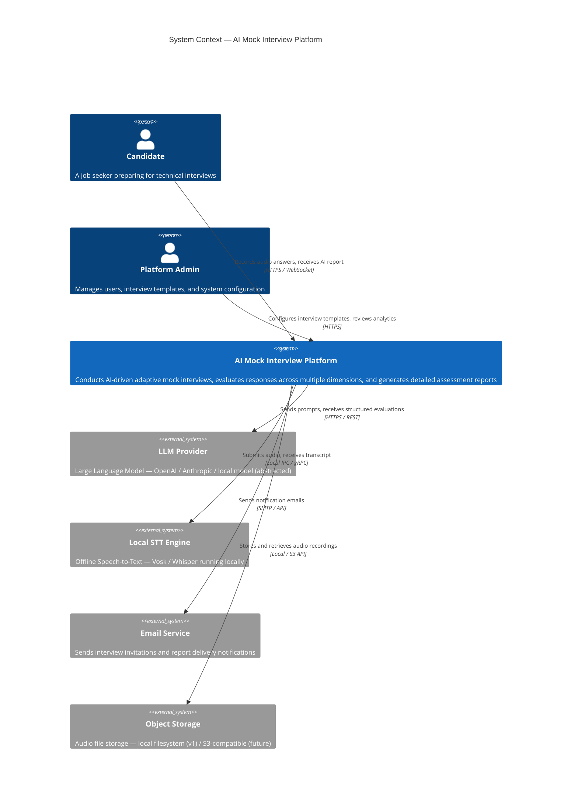

# 01 — System Design

> **Version:** V1 (Audio First)
> **Architecture Style:** Modular Monolith
> **Status:** Approved — Design Phase

---

## 1. Purpose

This document defines the end-to-end system design of the **AI Mock Interview & Assessment Platform**. It establishes the problem being solved, the system boundaries, the key stakeholders, and the overarching technical decisions that govern the entire architecture.

---

## 2. Problem Statement

Technical hiring is expensive, inconsistent, and slow. Human interviewers evaluate candidates differently based on mood, fatigue, and personal bias. Traditional mock interview platforms offer pre-recorded content without real adaptive feedback. Candidates lack access to structured, objective, and repeatable feedback across multiple dimensions — technical knowledge, English communication, and behavioral competence.

This platform addresses all three gaps by delivering:

- An **adaptive AI-driven interview experience**
- **Parallel multi-dimensional evaluation** (technical, language, behavioral)
- A **comprehensive, objective assessment report**

---

## 3. System Context Diagram



---

## 4. Stakeholders

| Stakeholder | Role | Primary Concern |
|---|---|---|
| Candidate | End User | Realistic interview experience + actionable feedback |
| Platform Admin | Operator | Configuration, monitoring, user management |
| Engineering Team | Developer | Clean architecture, testability, future extensibility |
| AI/ML Team | AI Engineer | Agent quality, prompt engineering, evaluation accuracy |
| Recruiter (future) | Consumer | View candidate reports, filter by scores |

---

## 5. System Capabilities (V1 Scope)

### In Scope

| Capability | Description |
|---|---|
| Adaptive Interview Conductor | AI generates context-aware follow-up questions, adjusts difficulty |
| Audio Recording | Candidate answers via browser microphone (WAV / WebM) |
| Local Speech-to-Text | Offline transcription with no external API dependency |
| Transcript Validation | Reject empty, too-short, or unintelligible transcripts |
| Parallel AI Evaluation | Technical, English, and Behavioral agents run concurrently |
| Evaluation Aggregation | Backend computes weighted composite scores (no LLM scoring) |
| Report Generation | Structured, human-readable assessment with recommendations |
| Interview State Machine | Stateful session tracking across all interview phases |
| User Authentication | JWT-based secure access |
| Dashboard | Candidate history, average scores, progress trends |

### Out of Scope (V1)

| Capability | Deferred To |
|---|---|
| Video Analysis | V2 |
| Emotion Detection | V2 |
| Live Human Reviewer | V3 |
| Real-time Recruiter Integration | V3 |
| Mobile Native App | V4 |
| Multi-language Support | V4 |

---

## 6. Core Design Decisions

| Decision | Choice | Rationale |
|---|---|---|
| **Architecture Style** | Modular Monolith | Team velocity + future microservice migration path |
| **Audio Only (V1)** | No video | Reduces infrastructure complexity, focus on core value |
| **Local STT** | Vosk / Whisper local | Candidate data privacy, no cloud dependency, zero STT cost |
| **LLM Abstraction** | Provider-agnostic factory | Swap OpenAI → Anthropic → local without code changes |
| **Parallel Agent Execution** | Java Virtual Threads (JDK 21) | Efficient concurrent evaluation without blocking I/O |
| **No LLM Scoring** | Backend Evaluation Aggregator | Reproducible, auditable, bias-free composite scoring |
| **Stateful Interview** | In-memory session + DB persistence | Maintains conversation context across turns |
| **Orchestrator Pattern** | Central Interview Orchestrator | Single point of coordination; no direct module-to-module calls |
| **Database** | PostgreSQL + Flyway | ACID compliance, strong relational model, migration-controlled schema |
| **API Style** | REST + WebSocket | REST for CRUD; WebSocket for real-time audio streaming and state push |

---

## 7. Quality Attributes

| Attribute | Target | Strategy |
|---|---|---|
| **Latency** | < 3 s end-to-end per turn | Local STT, parallel agents, async orchestration |
| **Reliability** | 99.9% uptime target | Health checks, circuit breakers, graceful degradation |
| **Scalability** | Horizontal pod scaling | Stateless HTTP layer; session state in DB |
| **Security** | OWASP Top 10 compliant | JWT, input validation, rate limiting, CORS, secrets vault |
| **Maintainability** | High cohesion, low coupling | Module boundaries enforced; orchestrator-centric flow |
| **Testability** | > 80% unit test coverage | Each module has isolated tests; agents are mockable |
| **Privacy** | Audio not sent to cloud | Local STT; audio purged after configurable retention period |

---

## 8. Technology Stack

### Backend

| Layer | Technology |
|---|---|
| Runtime | Java 21 (Virtual Threads) |
| Framework | Spring Boot 3.3 |
| Data Access | Spring Data JPA + Hibernate |
| Database | PostgreSQL 15 |
| Migration | Flyway |
| Security | Spring Security + JWT |
| Messaging (internal) | Spring ApplicationEvents (synchronous orchestration) |
| Async Concurrency | `CompletableFuture` + Virtual Thread Executor |
| API Documentation | SpringDoc OpenAPI 3 (Swagger UI) |
| Object Mapping | MapStruct |
| Boilerplate Reduction | Lombok |
| Testing | JUnit 5, Mockito, Testcontainers |

### Frontend

| Layer | Technology |
|---|---|
| Framework | Next.js 14 (App Router) |
| Language | TypeScript |
| Styling | Tailwind CSS |
| Audio Recording | MediaRecorder API (browser-native) |
| State Management | Zustand |
| HTTP Client | Axios + React Query |
| WebSocket | SockJS + STOMP |
| Testing | Jest + React Testing Library |

### Infrastructure

| Component | Technology |
|---|---|
| Containerization | Docker + Docker Compose |
| Reverse Proxy | Nginx |
| CI/CD | GitHub Actions |
| Secrets Management | Environment variables → Vault (future) |
| Monitoring | Spring Actuator + Prometheus + Grafana (future) |
| Logging | SLF4J + Logback + structured JSON |

---

## 9. Data Flow Summary

```
Candidate speaks into browser microphone
  → Audio captured as WebM/WAV blob
  → Streamed or uploaded to backend via REST
  → Speech Module transcribes using local STT engine
  → Transcript Validator checks quality
  → Interview Orchestrator receives validated transcript
  → Orchestrator dispatches Technical, English, Behavioral agents (parallel)
  → Evaluation Aggregator collects results and computes weighted scores
  → Orchestrator updates Interview Context (history, difficulty, scores)
  → Difficulty Manager recommends next difficulty level
  → Interview Agent generates next question
  → Next question returned to frontend
  → [Loop until max questions reached]
  → Report Compiler Agent generates narrative report
  → Report stored in database
  → Candidate receives notification and views report on dashboard
```

---

## 10. Advantages of This Design

- **Privacy-first**: Candidate audio never leaves the server; local STT ensures complete data sovereignty.
- **Objective scoring**: LLM is used for qualitative narrative only; numerical scores come from a deterministic aggregator.
- **Adaptive experience**: Difficulty adjusts in real time based on cumulative performance, mimicking a skilled human interviewer.
- **Modular boundaries**: Every module can be extracted into its own microservice with minimal rework when scaling needs arise.
- **Concurrent evaluation**: Parallel agent execution keeps per-question latency low regardless of the number of evaluation dimensions.

---

## 11. Future Scalability Path

| Phase | Change |
|---|---|
| V2 | Add video analysis agent; emotion and body language scoring |
| V2 | Introduce message broker (Kafka/RabbitMQ) for fully async agent execution |
| V3 | Extract modules into microservices behind API Gateway |
| V3 | Recruiter portal with candidate shortlisting and bulk report views |
| V4 | Multi-language STT and multilingual interview support |
| V4 | Mobile native app (React Native or Flutter) |
| V5 | Self-hosted fine-tuned domain-specific LLM for evaluation agents |
