# 02 — High-Level Architecture

> **Version:** V1 (Audio First)
> **Style:** Modular Monolith
> **Last Updated:** Architecture Review — Changes 1, 2, 3, 10
> **Status:** Approved — Updated

---

## 1. Purpose

This document defines the high-level architecture of the platform. It describes the primary layers, how they interact, and the reasoning behind each architectural boundary.

---

## 2. Revised System Stack

```
Next.js (Frontend)
        ↓  HTTPS / WSS
      Nginx (Reverse Proxy · TLS · Rate Limiting)
        ↓  HTTP :8080
   Spring Boot (Modular Monolith Backend)
        ↓  HTTP :8001 (internal Docker network)
  Python FastAPI (Speech Service — Faster-Whisper)
        ↓  HTTPS
   LLM Provider (OpenAI / Anthropic / Local)
        ↓  JDBC
     PostgreSQL 15
        ↓  (future)
       Redis (Cache · Rate Limits)
```

---

## 3. High-Level Architecture Diagram

```mermaid
graph TB
    subgraph CLIENT["Client Layer — Next.js 14"]
        UI_AUTH["Auth Pages"]
        UI_INTV["Interview UI — Audio Recording"]
        UI_RPT["Report Viewer"]
        UI_DASH["Dashboard"]
    end

    subgraph GATEWAY["Nginx — API Gateway"]
        NGINX["TLS · Rate Limiting · CORS · Reverse Proxy"]
    end

    subgraph BACKEND["Spring Boot 3 · Java 21 — Modular Monolith"]

        subgraph ORCH_MOD["Interview Orchestrator — Central Hub"]
            ORCH["InterviewOrchestrator<br/>State Machine · Pipeline · Coordination"]
            CTX["InterviewContextEngine<br/>History · Difficulty · Topics · Evaluations"]
        end

        subgraph CORE_MODS["Core Modules"]
            AUTH["Auth Module — JWT"]
            USER["User Module"]
            INTV_MOD["Interview Module"]
            RPT_MOD["Report Module"]
            DASH["Dashboard Module"]
            ANAL["Analytics Module"]
        end

        subgraph SPEECH_MOD["Speech Interface Module"]
            STT_CLIENT["SpeechServiceClient<br/>Interface abstraction"]
            AUDIO_PROC["AudioProcessor — Format convert"]
            TRANS_VAL["TranscriptValidator"]
        end

        subgraph AI_ORCH_MOD["AI Orchestration Layer"]
            AI_ORCH["AI Orchestrator"]
            PROMPT_MGR["Prompt Manager — Templates + Versioning"]
            PROMPT_BUILDER["Prompt Builder — System + User prompt"]
            CTX_INJECT["Context Injector"]
            RESP_PARSER["Response Parser"]
            SCHEMA_VAL["Schema Validator"]
        end

        subgraph AI_AGENTS_MOD["AI Agents"]
            INTV_AGENT["Interview Agent"]
            TECH_AGENT["Technical Agent"]
            ENG_AGENT["English Agent"]
            BEH_AGENT["Behavioral Agent"]
            RPT_AGENT["Report Compiler Agent"]
            EVAL_AGG["Evaluation Aggregator — Java only"]
            DIFF_MGR["Difficulty Manager"]
        end

        subgraph LLM_MOD["LLM Provider Module"]
            LLM_FAC["LlmProviderFactory — Abstraction"]
        end

    end

    subgraph STT_SVC["Python FastAPI — Speech Service :8001"]
        FASTAPI["FastAPI Server — Internal only"]
        FW["Faster-Whisper — Local ML inference"]
    end

    subgraph INFRA["Infrastructure"]
        DB[("PostgreSQL 15")]
        REDIS[("Redis — future")]
        STORE["Audio File Storage"]
    end

    subgraph EXT["External"]
        LLM_API["LLM API — OpenAI / Anthropic"]
        SMTP["Email Service"]
    end

    CLIENT --> NGINX
    NGINX --> BACKEND

    ORCH --> CTX
    ORCH --> SPEECH_MOD
    ORCH --> AI_ORCH_MOD
    ORCH --> DIFF_MGR
    ORCH --> INTV_MOD

    STT_CLIENT --> FASTAPI
    FASTAPI --> FW
    SPEECH_MOD --> STT_CLIENT
    SPEECH_MOD --> AUDIO_PROC
    SPEECH_MOD --> TRANS_VAL
    SPEECH_MOD --> STORE

    AI_ORCH --> PROMPT_MGR
    PROMPT_MGR --> PROMPT_BUILDER
    PROMPT_BUILDER --> CTX_INJECT
    AI_ORCH --> RESP_PARSER
    RESP_PARSER --> SCHEMA_VAL
    AI_ORCH --> TECH_AGENT
    AI_ORCH --> ENG_AGENT
    AI_ORCH --> BEH_AGENT
    AI_ORCH --> INTV_AGENT
    AI_ORCH --> RPT_AGENT

    TECH_AGENT --> LLM_FAC
    ENG_AGENT --> LLM_FAC
    BEH_AGENT --> LLM_FAC
    INTV_AGENT --> LLM_FAC
    RPT_AGENT --> LLM_FAC
    LLM_FAC --> LLM_API

    EVAL_AGG --> TECH_AGENT
    EVAL_AGG --> ENG_AGENT
    EVAL_AGG --> BEH_AGENT

    CORE_MODS --> DB
    AUTH --> REDIS
    RPT_MOD --> SMTP

    style ORCH_MOD fill:#1a1a2e,stroke:#e94560,color:#ffffff
    style AI_ORCH_MOD fill:#16213e,stroke:#0f3460,color:#ffffff
    style STT_SVC fill:#0f3460,stroke:#533483,color:#ffffff
```



---

## 4. Layer Descriptions

### 4.1 Client Layer

**Technology:** Next.js 14, TypeScript, Tailwind CSS

The frontend is stateless — all interview state lives on the backend. It handles:
- Audio recording via MediaRecorder API
- Real-time state updates via WebSocket / STOMP
- Report rendering with charts and narrative feedback

### 4.2 API Gateway

**Technology:** Nginx

Routes `/api/*` → Spring Boot `:8080`, `/*` → Next.js `:3000`. The Python Speech Service is **not exposed through Nginx** — internal only.

### 4.3 Backend Modules

| Module | Responsibility |
|---|---|
| `auth` | JWT auth, token issuance, refresh |
| `user` | Candidate profile |
| `interview` | Session CRUD, audio upload, state persistence |
| `orchestrator` | Central hub — drives entire pipeline |
| `context` | Interview Context Engine |
| `speech` | Speech Service Interface, audio processing, validation |
| `ai.orchestrator` | AI Orchestration Layer — prompt + agent coordination |
| `ai.agents` | All specialized AI agents |
| `ai.provider` | LLM abstraction factory |
| `report` | Storage, retrieval, PDF export |
| `dashboard` | Aggregated stats |
| `analytics` | Score trends |
| `difficulty` | Difficulty management |

### 4.4 Interview Orchestrator (Central Hub)

No module communicates directly with another. All pipeline coordination flows through the Orchestrator:

1. Receives validated transcript
2. Reads/updates **Interview Context Engine**
3. Delegates to **AI Orchestration Layer** for parallel evaluation
4. Invokes Evaluation Aggregator (Java only — no LLM)
5. Invokes Difficulty Manager
6. Invokes Interview Agent for next question
7. Persists state to PostgreSQL

### 4.5 Interview Context Engine *(New — Change 3)*

An independent stateful component owned by the Orchestrator module. Maintains the full live session view:

| Field | Description |
|---|---|
| `conversationHistory` | All prior Q&A turns |
| `currentDifficulty` | Active difficulty level |
| `questionHistory` | All generated questions |
| `weakTopics` | Topics below score threshold |
| `strongTopics` | Topics with high scores |
| `interviewState` | Current state machine state |
| `previousEvaluations` | Per-turn evaluation summaries |
| `timingMetadata` | Turn durations, total elapsed |
| `candidateMetadata` | Domain, role level, name |

See [15-interview-context.md](./15-interview-context.md) for full documentation.

### 4.6 AI Orchestration Layer *(New — Change 2)*

A dedicated sub-layer between the Interview Orchestrator and the AI agents:

| Component | Responsibility |
|---|---|
| `AI Orchestrator` | Coordinates agents; manages parallel execution |
| `Prompt Manager` | Versioned prompt templates |
| `Prompt Builder` | Assembles system + user prompt |
| `Context Injector` | Injects Interview Context into prompt |
| `Response Parser` | Parses LLM JSON into typed objects |
| `Schema Validator` | Validates response against JSON contract |

See [13-prompt-architecture.md](./13-prompt-architecture.md) for prompt lifecycle.

### 4.7 Speech Interface → Python FastAPI *(Updated — Change 1)*

**Previous:** Spring Boot invoked Vosk/Whisper via subprocess.

**Revised:** Spring Boot calls a dedicated **Python FastAPI Speech Service** over internal HTTP.

```
Spring Boot SpeechServiceClient
        ↓  POST /transcribe (internal HTTP :8001)
Python FastAPI Speech Service
        ↓  in-process
Faster-Whisper (local ML inference)
```

**Rationale:**
- ML inference is Python-native; subprocess invocation from JVM is fragile
- Faster-Whisper outperforms original Whisper at equivalent accuracy
- STT container scales independently from the backend
- Spring Boot depends only on `SpeechServiceClient` interface — implementation is swappable

Spring Boot remains responsible for audio format conversion (WebM → WAV) before calling the service.

---

## 5. Communication Patterns

| Path | Protocol | Notes |
|---|---|---|
| Frontend ↔ Backend | HTTPS | REST + JWT auth |
| Frontend ↔ Backend (real-time) | WebSocket / STOMP | State push, question delivery |
| Backend → Python STT Service | HTTP (internal) | Docker bridge; port 8001; not public |
| Backend → LLM API | HTTPS | Via LlmProvider abstraction |
| Backend → PostgreSQL | JDBC | Standard connection |
| Internal modules | Java method calls | Via Orchestrator only |

---

## 6. Key Advantages

- **Python STT isolation** — ML inference in its natural runtime; JVM not burdened
- **AI Orchestration Layer** — Prompt engineering fully encapsulated; agents decoupled from prompt construction
- **Interview Context Engine** — All session intelligence centralized; easy to extend
- **Zero inter-module coupling** — enforced by orchestrator-centric flow
- **Deterministic scoring** — composite scores computed purely in Java Aggregator

---

## 7. Future Scalability

| Trigger | Action |
|---|---|
| STT throughput | Scale Python STT containers independently |
| LLM latency | Kafka between AI Orchestrator and agents |
| DB read pressure | PostgreSQL read replicas + Redis caching |
| Team ownership | Extract modules into microservices |
| Context size | Archive old turns; inject last N turns only |
