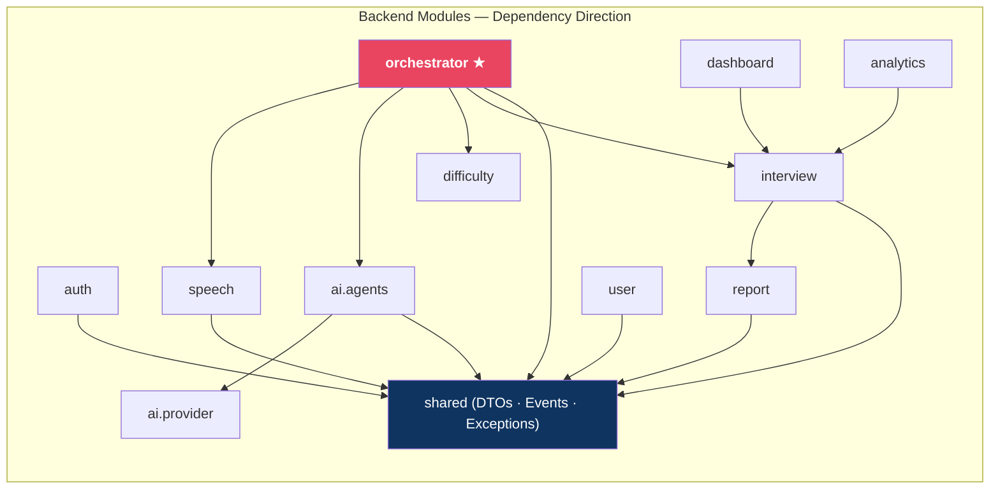
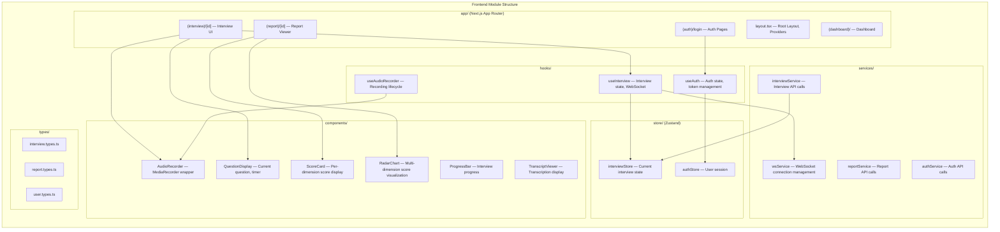

# 03 — Component Diagram

> **Version:** V1 (Audio First)
> **Status:** Approved — Design Phase

---

## 1. Purpose

This document provides detailed component-level diagrams for the platform. It drills into the internal structure of each major subsystem, showing the individual components within each module, their responsibilities, and their relationships.

---

## 2. Full System Component Diagram

```mermaid
graph TB
    subgraph FE["Frontend (Next.js 14)"]
        FE_AUTH["AuthModule<br/>Login · Register · Token Storage"]
        FE_INTV["InterviewModule<br/>Audio Recorder · WebSocket Client · Question Display"]
        FE_RPT["ReportModule<br/>Score Charts · Narrative · Export"]
        FE_DASH["DashboardModule<br/>History · Progress · Stats"]
        FE_STORE["State Store (Zustand)<br/>Global App State"]
        FE_HTTP["HTTP Client (Axios + React Query)<br/>REST API calls"]
        FE_WS["WebSocket Client (SockJS/STOMP)<br/>Real-time updates"]
    end

    subgraph BE["Backend (Spring Boot 3 — Modular Monolith)"]

        subgraph AUTH["auth module"]
            AUTH_FILTER["JwtAuthFilter"]
            AUTH_SVC["AuthService"]
            AUTH_TOKEN["TokenProvider"]
        end

        subgraph USER["user module"]
            USER_SVC["UserService"]
            USER_REPO["UserRepository"]
        end

        subgraph INTV["interview module"]
            INTV_CTRL["InterviewController"]
            INTV_SVC["InterviewService"]
            INTV_REPO["InterviewRepository"]
            ANS_REPO["AnswerRepository"]
        end

        subgraph ORCH["orchestrator module ★"]
            ORCH_SVC["InterviewOrchestrator"]
            CTX_MGR["InterviewContextManager"]
            STATE_MGR["StateManager"]
            PIPE_MGR["PipelineCoordinator"]
        end

        subgraph SPEECH["speech module"]
            AUDIO_SVC["AudioProcessingService"]
            STT_SVC["SpeechToTextService"]
            STT_PROV["SpeechToTextProvider (interface)"]
            VOSK["VoskProvider"]
            WHISPER["WhisperProvider"]
            TRANS_VAL["TranscriptValidator"]
        end

        subgraph AI_AGENTS["ai.agents module"]
            INTV_AGENT["InterviewAgent"]
            TECH_AGENT["TechnicalEvaluationAgent"]
            ENG_AGENT["EnglishCommunicationAgent"]
            BEH_AGENT["BehavioralEvaluationAgent"]
            RPT_AGENT["ReportCompilerAgent"]
            EVAL_AGG["EvaluationAggregator"]
            DIFF_MGR["DifficultyManager"]
        end

        subgraph AI_PROV["ai.provider module"]
            LLM_FACTORY["LlmProviderFactory"]
            LLM_IFACE["LlmProvider (interface)"]
            OPENAI_PROV["OpenAiProvider"]
            ANTHROPIC_PROV["AnthropicProvider"]
            LOCAL_PROV["LocalLlmProvider"]
        end

        subgraph RPT["report module"]
            RPT_SVC["ReportService"]
            RPT_REPO["ReportRepository"]
            RPT_EXPORT["ReportExporter (PDF/JSON)"]
        end

        subgraph DASH["dashboard module"]
            DASH_SVC["DashboardService"]
        end

        subgraph ANAL["analytics module"]
            ANAL_SVC["AnalyticsService"]
            ANAL_REPO["AnalyticsRepository"]
        end

    end

    subgraph INFRA["Infrastructure"]
        POSTGRES[("PostgreSQL 15")]
        REDIS[("Redis")]
        AUDIO_STORE["Audio File Store"]
    end

    subgraph EXT["External"]
        LLM_API["LLM API (OpenAI / Anthropic)"]
        LOCAL_STT["Local STT Engine (Vosk / Whisper)"]
    end

    %% Frontend internal
    FE_INTV --> FE_STORE
    FE_INTV --> FE_WS
    FE_INTV --> FE_HTTP
    FE_AUTH --> FE_HTTP
    FE_RPT --> FE_HTTP
    FE_DASH --> FE_HTTP

    %% Frontend → Backend
    FE_HTTP --> INTV_CTRL
    FE_WS --> ORCH_SVC

    %% Auth chain
    AUTH_FILTER --> AUTH_SVC
    AUTH_SVC --> AUTH_TOKEN
    AUTH_SVC --> USER_REPO

    %% Interview Module
    INTV_CTRL --> INTV_SVC
    INTV_SVC --> INTV_REPO
    INTV_SVC --> ORCH_SVC

    %% Orchestrator (Central Hub)
    ORCH_SVC --> CTX_MGR
    ORCH_SVC --> STATE_MGR
    ORCH_SVC --> PIPE_MGR
    ORCH_SVC --> STT_SVC
    ORCH_SVC --> TECH_AGENT
    ORCH_SVC --> ENG_AGENT
    ORCH_SVC --> BEH_AGENT
    ORCH_SVC --> EVAL_AGG
    ORCH_SVC --> DIFF_MGR
    ORCH_SVC --> INTV_AGENT
    ORCH_SVC --> RPT_AGENT

    %% Speech Module
    STT_SVC --> STT_PROV
    STT_PROV --> VOSK
    STT_PROV --> WHISPER
    STT_SVC --> TRANS_VAL
    AUDIO_SVC --> STT_SVC

    %% AI Agents → LLM Provider
    INTV_AGENT --> LLM_FACTORY
    TECH_AGENT --> LLM_FACTORY
    ENG_AGENT --> LLM_FACTORY
    BEH_AGENT --> LLM_FACTORY
    RPT_AGENT --> LLM_FACTORY
    LLM_FACTORY --> LLM_IFACE
    LLM_IFACE --> OPENAI_PROV
    LLM_IFACE --> ANTHROPIC_PROV
    LLM_IFACE --> LOCAL_PROV

    %% Report
    RPT_AGENT --> RPT_SVC
    RPT_SVC --> RPT_REPO
    RPT_SVC --> RPT_EXPORT

    %% Infrastructure
    USER_REPO --> POSTGRES
    INTV_REPO --> POSTGRES
    ANS_REPO --> POSTGRES
    RPT_REPO --> POSTGRES
    ANAL_REPO --> POSTGRES
    AUTH_SVC --> REDIS
    AUDIO_SVC --> AUDIO_STORE

    %% External
    OPENAI_PROV --> LLM_API
    ANTHROPIC_PROV --> LLM_API
    VOSK --> LOCAL_STT
    WHISPER --> LOCAL_STT

    style ORCH fill:#1a1a2e,stroke:#e94560,color:#ffffff,font-weight:bold
    style AI_AGENTS fill:#16213e,stroke:#0f3460,color:#ffffff
```

---

## 3. Backend Module Diagram

---

## 4. Frontend Module Diagram

---

## 5. Component Responsibility Matrix

| Component | Module | Responsibility | Calls |
|---|---|---|---|
| `InterviewOrchestrator` | orchestrator | Central pipeline coordinator | Speech, all Agents, Aggregator, Difficulty, DB |
| `InterviewContextManager` | orchestrator | Maintains in-memory interview context | — |
| `StateManager` | orchestrator | Transitions interview state machine states | — |
| `PipelineCoordinator` | orchestrator | Manages parallel agent execution via CompletableFuture | All evaluation agents |
| `SpeechToTextService` | speech | Invokes STT provider, validates transcript | STT Provider, TranscriptValidator |
| `TranscriptValidator` | speech | Checks length, coherence, quality | — |
| `TechnicalEvaluationAgent` | ai.agents | Evaluates technical correctness and depth | LLM Provider |
| `EnglishCommunicationAgent` | ai.agents | Evaluates language quality | LLM Provider |
| `BehavioralEvaluationAgent` | ai.agents | Evaluates soft skills via STAR method | LLM Provider |
| `InterviewAgent` | ai.agents | Generates next question based on context | LLM Provider |
| `EvaluationAggregator` | ai.agents | Computes weighted composite scores from agent results | — |
| `DifficultyManager` | difficulty | Determines next question difficulty | — |
| `ReportCompilerAgent` | ai.agents | Generates narrative report | LLM Provider |
| `LlmProviderFactory` | ai.provider | Returns the configured LLM provider implementation | Provider implementations |
| `ReportService` | report | Persists and retrieves reports | ReportRepository |

---

## 6. Design Decisions

### 6.1 Shared Module for Cross-Cutting Concerns

A `shared` module contains:
- Common DTOs (Data Transfer Objects)
- Domain events
- Exception hierarchy
- Utility classes

This prevents circular dependencies while allowing modules to share contracts.

### 6.2 Interface-First for Providers

Both the STT and LLM subsystems are designed interface-first:
- `SpeechToTextProvider` — implemented by `VoskProvider`, `WhisperProvider`
- `LlmProvider` — implemented by `OpenAiProvider`, `AnthropicProvider`, `LocalLlmProvider`

The active implementation is selected at startup via configuration properties, enabling zero-code-change provider swaps.

### 6.3 No Module-to-Module Direct Calls

Strict enforcement: no module import from another module except via the shared module or through the Orchestrator. This is the core rule that makes future microservice extraction possible.

---

## 7. Best Practices Applied

| Practice | Application |
|---|---|
| Interface Segregation | Each agent implements a focused single-method interface |
| Dependency Inversion | All modules depend on abstractions, not concrete implementations |
| Single Responsibility | Each component has one well-defined job |
| Open/Closed | Adding a new LLM provider requires no changes to existing code |
| Repository Pattern | All database access via typed Spring Data repositories |
| Factory Pattern | LLM and STT provider selection via factory |
