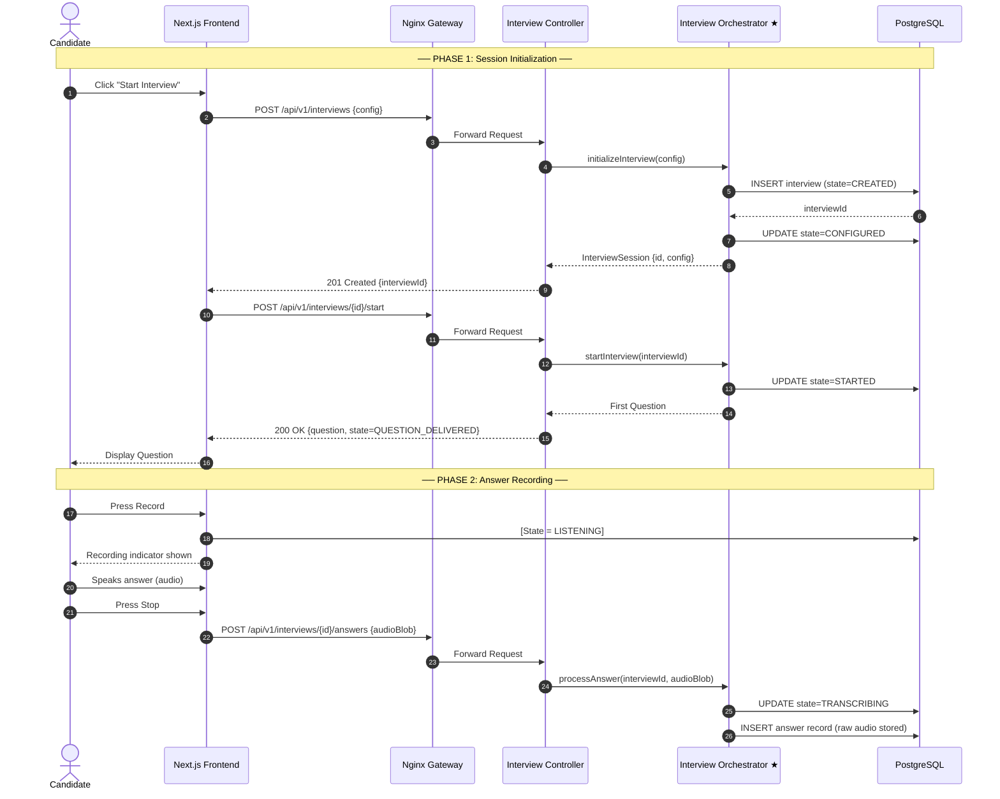
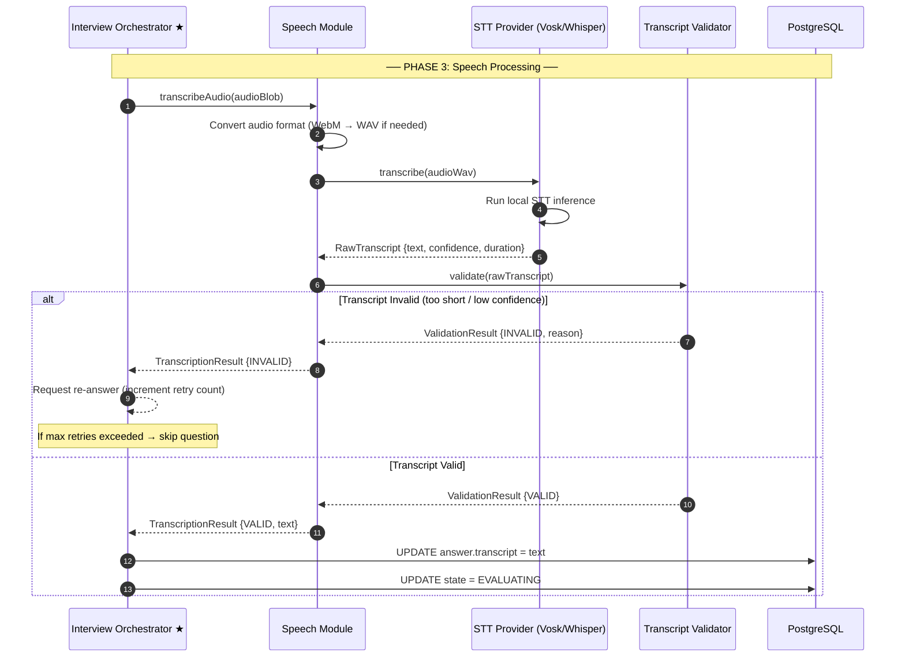
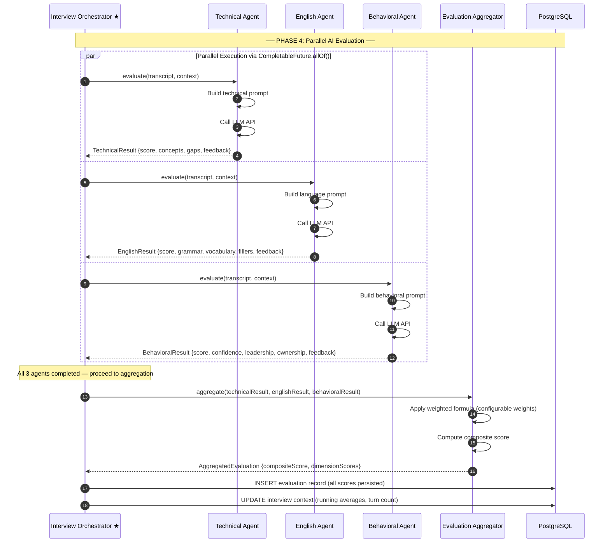
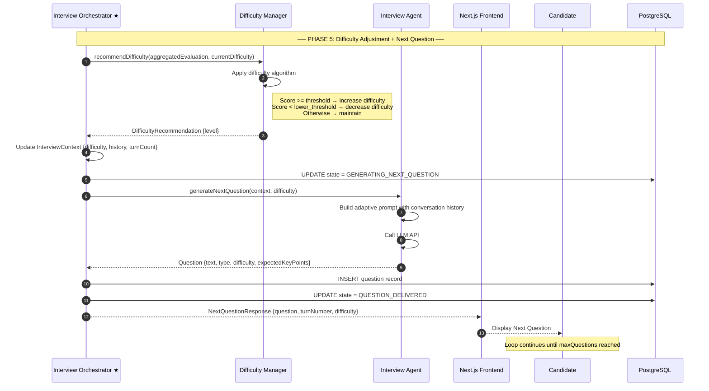
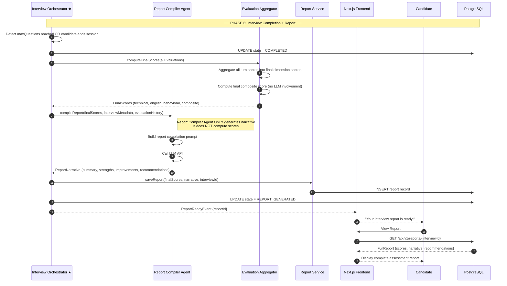

# 04 — Interview Sequence Diagram

> **Version:** V1 (Audio First)
> **Status:** Approved — Design Phase

---

## 1. Purpose

This document captures the complete sequence of interactions between all system participants during an interview session. It covers: session initialization, question delivery, audio recording, transcription, parallel evaluation, and report generation.

---

## 2. Participants

| Participant | Abbreviation | Role |
|---|---|---|
| Candidate (Browser) | `CAND` | Records audio, receives questions |
| Next.js Frontend | `FE` | Manages UI state, audio streaming |
| Nginx | `NGINX` | API Gateway |
| Interview Controller | `CTRL` | HTTP entry point |
| Interview Orchestrator | `ORCH` | Central coordinator |
| Speech Module | `SPEECH` | Transcription + validation |
| Technical Agent | `TECH` | Technical evaluation |
| English Agent | `ENG` | Language evaluation |
| Behavioral Agent | `BEH` | Behavioral evaluation |
| Evaluation Aggregator | `AGG` | Score computation |
| Difficulty Manager | `DIFF` | Difficulty adjustment |
| Interview Agent | `INTV_AGENT` | Question generation |
| Report Compiler Agent | `RPT_AGENT` | Report narrative |
| Database | `DB` | Persistence |

---

## 3. Full Interview Sequence Diagram

---

## 4. Speech Processing Sequence

---

## 5. Parallel Evaluation Sequence

---

## 6. Next Question Generation Sequence

---

## 7. Report Generation Sequence

---

## 8. Key Design Decisions

### 8.1 Stateful Session, Stateless HTTP

The interview session is stateful in the database. However, the HTTP layer remains stateless — each request is independently authenticated via JWT. The Interview Orchestrator reconstructs session context from the database on each request.

### 8.2 WebSocket for Real-time Updates

For latency-sensitive updates (question delivery, state transitions), a WebSocket channel pushes events from the backend to the frontend without polling.

### 8.3 Parallel Agent Execution

The three evaluation agents run concurrently using `CompletableFuture.allOf()`. The orchestrator does not proceed until all three complete, ensuring consistent aggregation.

### 8.4 Retry Mechanism for Invalid Transcripts

If the transcript is rejected, the orchestrator prompts the candidate to re-answer (up to a configured maximum number of retries). After the maximum, the turn is skipped and scored as zero.

### 8.5 Report Compiler Separation

The Report Compiler Agent is invoked only once, at the very end. It is deliberately isolated from the evaluation pipeline. It only sees final scores and metadata — it never evaluates individual answers.
