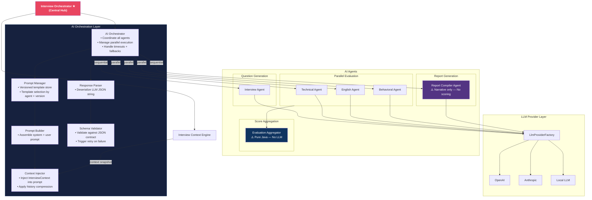
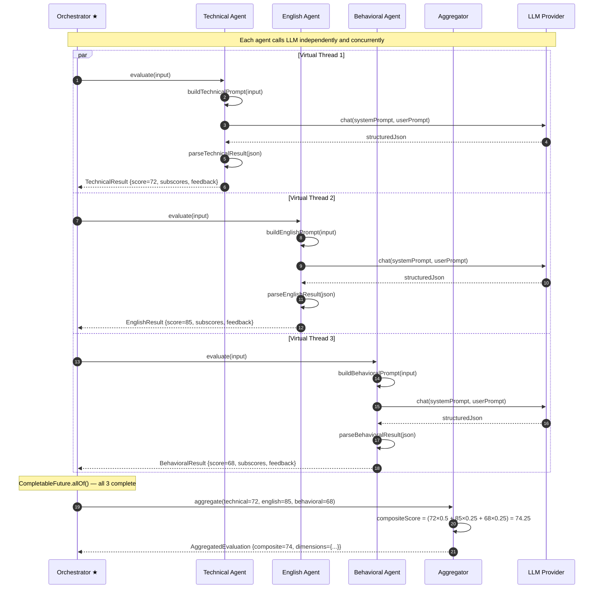
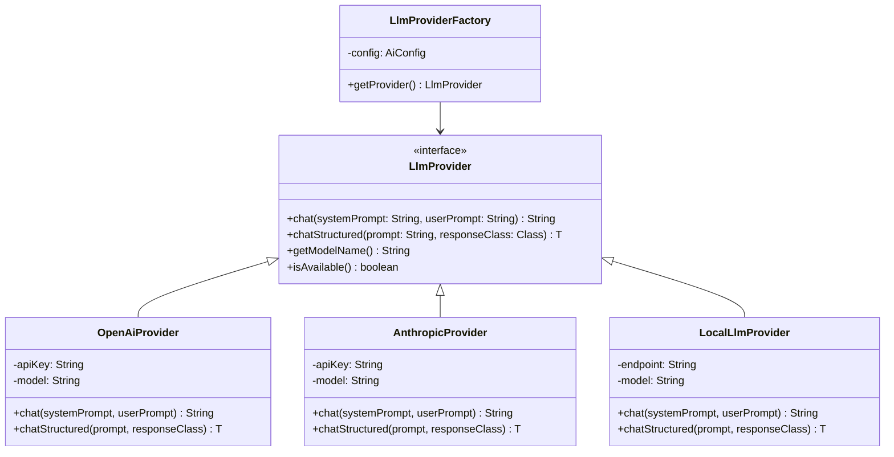
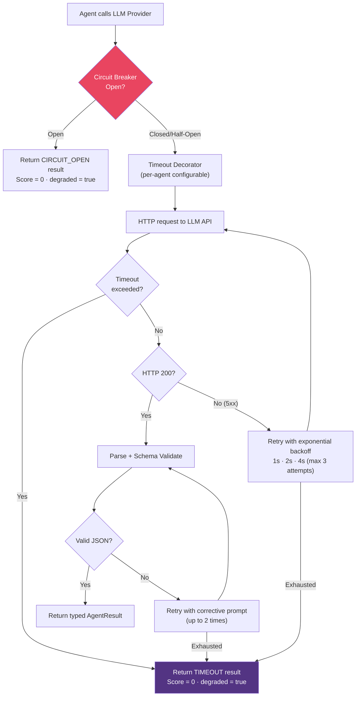
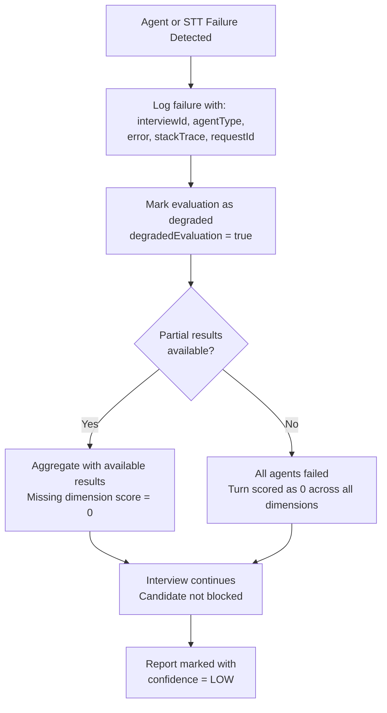

# 05 — AI Agent Architecture

> **Version:** V1 (Audio First)
> **Last Updated:** Architecture Review — Changes 2, 8, 11
> **Status:** Approved — Updated
> **Related:** [13-prompt-architecture.md](./13-prompt-architecture.md) · [14-ai-json-contracts.md](./14-ai-json-contracts.md)

---

## 1. Purpose

This document defines the complete architecture of the AI agent system. It describes each agent's design, responsibilities, prompt strategy, input/output contracts, and how agents collaborate through the Orchestrator without communicating directly with one another.

---

## 2. Agent System Overview

The platform uses a **multi-agent evaluation architecture**. Each agent is a specialized, stateless component that performs a single, well-defined evaluation task. Agents:

- Share a common interface contract
- Are invoked exclusively by the **AI Orchestrator** (within the AI Orchestration Layer)
- Communicate with the LLM through the shared `LlmProvider` abstraction
- Receive context through the **Context Injector** — they never read the InterviewContext directly
- Return structured, typed result objects — **never raw LLM strings**
- All LLM responses are parsed and schema-validated before use

The Interview Orchestrator delegates all agent coordination to the **AI Orchestration Layer**. Agents do not know about each other.

---

## 3. AI Orchestration Layer *(New — Change 2)*

The **AI Orchestration Layer** is a dedicated sub-layer that sits between the Interview Orchestrator and the AI agents. It encapsulates all prompt engineering, agent dispatching, response parsing, and schema validation.



### 3.1 AI Orchestration Layer Component Responsibilities

| Component | Responsibility |
|---|---|
| **AI Orchestrator** | Receives request from Interview Orchestrator; decides agent execution order (parallel vs sequential); aggregates results |
| **Prompt Manager** | Loads versioned prompt templates at startup; returns template by agent type and configured version |
| **Prompt Builder** | Takes a raw template and assembles the `systemPrompt` + `userPrompt` strings |
| **Context Injector** | Reads the `InterviewContext` snapshot and injects relevant fields into the prompt placeholders; applies history compression |
| **Response Parser** | Deserializes the raw LLM response string into a typed Java object |
| **Schema Validator** | Validates the parsed object against the JSON contract defined in [14-ai-json-contracts.md](./14-ai-json-contracts.md); triggers retry on failure |

See [13-prompt-architecture.md](./13-prompt-architecture.md) for full prompt lifecycle documentation.

---

## 4. Common Agent Interface Contract

All agents that communicate with the LLM implement a common interface:

```
AgentInput {
    interviewId     : UUID
    questionText    : String
    transcript      : String           — validated candidate answer
    conversationHistory : List<Turn>   — prior Q&A turns
    interviewDomain : String           — e.g., "Backend Java", "System Design"
    difficulty      : DifficultyLevel  — EASY / MEDIUM / HARD / EXPERT
}

AgentResult {
    agentType       : AgentType
    score           : Integer          — 0-100
    subscores       : Map<String, Integer>
    feedback        : String           — human-readable explanation
    strengths       : List<String>
    improvements    : List<String>
    processingTimeMs: Long
}
```

The `EvaluationAggregator` is not an LLM agent — it receives `AgentResult` objects and computes the composite score deterministically.

---

## 5. Interview Agent

### 5.1 Responsibilities

| Responsibility | Description |
|---|---|
| Generate opening question | Based on interview domain, role level, and difficulty |
| Generate follow-up question | Context-aware follow-ups to probe deeper into the candidate's answer |
| Generate next question | Considering conversation history and current difficulty level |
| Adapt difficulty | Accept difficulty signal from DifficultyManager and adjust question complexity |
| Maintain interview flow | Ensure varied topic coverage; avoid repetition |

### 5.2 Prompt Strategy

The Interview Agent receives a structured prompt containing:
- **System role**: "You are an expert technical interviewer for [domain]..."
- **Interview constraints**: Number of questions remaining, topics already covered, difficulty level
- **Conversation history**: All previous Q&A pairs (compressed for long sessions)
- **Instruction**: "Generate the next interview question..."

**Output format (structured JSON from LLM):**
```json
{
  "questionText": "...",
  "questionType": "TECHNICAL | BEHAVIORAL | SITUATIONAL",
  "difficultyLevel": "MEDIUM",
  "expectedKeyPoints": ["...", "..."],
  "followUpHints": ["...", "..."]
}
```

### 5.3 Difficulty Adaptation

The Interview Agent adjusts question complexity based on the `DifficultyLevel` signal it receives:

| DifficultyLevel | Behavior |
|---|---|
| `EASY` | Fundamental definitions, basic concepts |
| `MEDIUM` | Applied knowledge, common patterns |
| `HARD` | Advanced trade-offs, complex scenarios |
| `EXPERT` | System design, architectural decisions, edge cases |

---

## 6. Technical Evaluation Agent

### 6.1 Responsibilities

| Dimension | Evaluation Criteria |
|---|---|
| **Correctness** | Is the candidate's answer factually correct? |
| **Concept Depth** | Does the candidate understand underlying principles? |
| **Problem Solving** | Is the reasoning and approach sound? |
| **Missing Concepts** | What important concepts were omitted? |

### 6.2 Subscores

| Subscore | Weight | Description |
|---|---|---|
| `correctness` | 40% | Accuracy of the answer |
| `depth` | 30% | Theoretical understanding |
| `problemSolving` | 20% | Approach quality and reasoning |
| `completeness` | 10% | Coverage of expected key points |

### 6.3 Prompt Strategy

The Technical Agent receives:
- The question text and its expected key points
- The candidate's transcript
- The interview domain (e.g., "Java Backend", "System Design")

It returns a structured JSON evaluation with scores and specific feedback for each dimension.

---

## 7. English Communication Agent

### 7.1 Responsibilities

| Dimension | Evaluation Criteria |
|---|---|
| **Grammar** | Correct sentence structure, tense, agreement |
| **Vocabulary** | Range and appropriateness of technical vocabulary |
| **Fluency** | Smooth delivery, coherent sentence flow |
| **Filler Words** | Detection of "um", "uh", "you know", excessive pauses |
| **Professional Tone** | Appropriateness for a professional interview context |

### 7.2 Subscores

| Subscore | Weight | Description |
|---|---|---|
| `grammar` | 25% | Grammatical correctness |
| `vocabulary` | 25% | Word choice and range |
| `fluency` | 25% | Flow and coherence |
| `professional` | 15% | Formal register maintenance |
| `fillerPenalty` | 10% | Penalty score for excessive fillers |

### 7.3 Design Note

The English Agent evaluates the **transcribed text**, not raw audio. Filler word detection is based on text patterns ("um", "uh", "like", "you know", repeated words). Prosodic features (pauses, rate) are out of scope for V1.

---

## 8. Behavioral Evaluation Agent

### 8.1 Responsibilities

The Behavioral Agent uses the **STAR method** (Situation, Task, Action, Result) as its primary evaluation framework when applicable, and additionally evaluates:

| Dimension | Evaluation Criteria |
|---|---|
| **Confidence** | Assertive language, directness, certainty in statements |
| **Leadership** | Evidence of leading teams, initiatives, or decisions |
| **Ownership** | Takes responsibility for outcomes (positive and negative) |
| **Decision Making** | Articulates clear decision rationale |
| **Professionalism** | Respectful, constructive, mature communication |

### 8.2 Subscores

| Subscore | Weight | Description |
|---|---|---|
| `confidence` | 25% | Assertiveness and directness |
| `leadership` | 20% | Leadership signals in narrative |
| `ownership` | 20% | Accountability language |
| `decisionMaking` | 20% | Quality of reasoning and choices |
| `professionalism` | 15% | Tone and maturity |

### 8.3 STAR Detection

For behavioral questions ("Tell me about a time when..."), the agent additionally evaluates STAR completeness:
- **S**ituation: Was context provided?
- **T**ask: Was the role/challenge described?
- **A**ction: Were concrete actions detailed?
- **R**esult: Was a measurable outcome stated?

---

## 9. Evaluation Aggregator (Non-LLM Component)

### 9.1 Design Rationale

> **Critical Design Decision:** The Evaluation Aggregator does NOT use an LLM. It is a pure Java computation component.

**Reason:** LLM-generated scores are non-deterministic and cannot be reproduced. Composite scores must be auditable, consistent, and explainable to candidates.

### 9.2 Aggregation Formula

```
compositeScore = (
    technicalScore * technicalWeight  +
    englishScore   * englishWeight    +
    behavioralScore * behavioralWeight
) / (technicalWeight + englishWeight + behavioralWeight)
```

Default configurable weights (V1):

| Dimension | Default Weight |
|---|---|
| Technical | 50% |
| English | 25% |
| Behavioral | 25% |

Weights are configurable per interview template and can be adjusted without code changes.

### 9.3 Per-Turn vs. Final Aggregation

- **Per-turn**: Aggregator computes composite score for each Q&A turn
- **Final**: Aggregator computes interview-level averages across all turns, weighted by question difficulty

---

## 10. Report Compiler Agent

### 10.1 Responsibilities

The Report Compiler Agent is the final agent invoked in the pipeline. It receives:
- All final aggregated scores (technical, english, behavioral, composite)
- Interview metadata (domain, role level, duration, question count)
- Per-turn evaluation summaries

It generates:
- **Executive summary** — 2-3 sentence overall performance narrative
- **Strengths** — Top 3-5 observed strengths with evidence
- **Areas for Improvement** — Top 3-5 specific gaps with actionable guidance
- **Recommendations** — Curated learning resources, practice strategies
- **Overall verdict** — Hire Recommendation level (Strongly Consider / Consider / Further Rounds / Not Recommended)

### 10.2 What the Report Compiler Does NOT Do

- ❌ Does not evaluate individual answers
- ❌ Does not compute scores of any kind
- ❌ Does not see raw transcripts
- ✅ Only receives pre-computed, aggregated data

### 10.3 Output Structure

```json
{
  "executiveSummary": "...",
  "overallVerdict": "CONSIDER",
  "strengthHighlights": ["...", "..."],
  "improvementAreas": [
    {
      "area": "Technical Depth — Concurrency",
      "observation": "...",
      "recommendation": "..."
    }
  ],
  "studyPlan": ["...", "..."],
  "interviewerNotes": "..."
}
```

---

## 11. AI Agent Sequence Diagram



---

## 12. LLM Provider Abstraction



---

## 13. AI Resilience Architecture *(Expanded — Change 8)*

### 13.1 Resilience Strategy Overview



### 13.2 Retry Strategy

| Failure Type | Max Retries | Backoff | Trigger |
|---|---|---|---|
| LLM HTTP 5xx | 3 | Exponential: 1s, 2s, 4s | Server error from LLM API |
| LLM HTTP 429 (rate limit) | 3 | Exponential + jitter | Rate limit exceeded |
| JSON parse error | 2 | None (immediate) | Malformed LLM response |
| Schema validation error | 2 | None (immediate) | Valid JSON but wrong structure |
| Connection timeout | 1 | 500ms | Network unreachable |

### 13.3 Timeout Configuration

| Component | Default Timeout | Configurable Via |
|---|---|---|
| Technical Agent LLM call | 30 seconds | `ai.agents.technical.timeout-seconds` |
| English Agent LLM call | 20 seconds | `ai.agents.english.timeout-seconds` |
| Behavioral Agent LLM call | 25 seconds | `ai.agents.behavioral.timeout-seconds` |
| Interview Agent LLM call | 25 seconds | `ai.agents.interview.timeout-seconds` |
| Report Compiler LLM call | 60 seconds | `ai.agents.report.timeout-seconds` |
| Global allOf() ceiling | 35 seconds | `ai.orchestrator.parallel-timeout-seconds` |
| Python STT service call | 60 seconds | `speech.service.timeout-seconds` |

### 13.4 Circuit Breaker Configuration

All LLM provider calls are wrapped in a Resilience4j circuit breaker:

| Parameter | Value | Description |
|---|---|---|
| `failureRateThreshold` | 50% | Open after 50% failure rate in sliding window |
| `slidingWindowSize` | 10 | Evaluate last 10 calls |
| `waitDurationInOpenState` | 30 seconds | Half-open after 30s |
| `permittedCallsInHalfOpenState` | 3 | Test 3 calls in half-open state |
| `slowCallDurationThreshold` | 20 seconds | Calls slower than this count as slow |
| `slowCallRateThreshold` | 80% | Open circuit if 80% of calls are slow |

### 13.5 Fallback Provider Strategy

When the primary LLM provider's circuit breaker opens, the `LlmProviderFactory` can optionally fall over to a secondary provider:

```
Primary:   OpenAI GPT-4o
    ↓ circuit open
Fallback:  Anthropic Claude (if configured)
    ↓ circuit open
Degraded:  Return AgentResult with status=CIRCUIT_OPEN
```

Fallback provider is configured in `application.yml`:
```yaml
ai:
  provider:
    primary: OPENAI
    fallback: ANTHROPIC   # optional; omit to disable fallback
```

### 13.6 Malformed JSON Handling

When the LLM returns a response that fails JSON parsing:
1. The Response Parser catches the deserialization error
2. A **corrective retry prompt** is sent: `"Your previous response was not valid JSON. Respond ONLY with a JSON object matching the schema. No prose, no markdown."`
3. Up to 2 corrective retries are attempted
4. If still invalid after retries → `AgentResult { status=PARSE_ERROR, score=0, degraded=true }`

### 13.7 Speech Service Failure Handling

When the Python FastAPI Speech Service is unreachable or returns an error:

| Scenario | Response |
|---|---|
| HTTP 503 from STT service | Retry 3 times with 2s backoff |
| STT timeout (>60s) | Return `TranscriptionResult { status=TIMEOUT }` |
| Empty transcript returned | `TranscriptValidator` marks as INVALID → candidate prompted to re-answer |
| STT service circuit open | Return `TranscriptionResult { status=SERVICE_UNAVAILABLE }` → interview paused, candidate notified |

### 13.8 Recovery Flow



### 13.9 Best Practices

| Practice | Implementation |
|---|---|
| **Structured Output enforcement** | JSON mode enabled on all LLM calls |
| **Retry with backoff** | HTTP failures retried up to 3× with exponential backoff |
| **Corrective retry for parse errors** | Invalid JSON triggers a corrective prompt retry (2×) |
| **Timeout per agent** | Each agent has an independent, configurable timeout |
| **Global ceiling** | `allOf()` has a hard ceiling; agents not yet complete return fallback |
| **Circuit breaker** | Resilience4j wraps all external LLM + STT calls |
| **Fallback provider** | Optional secondary LLM provider when primary circuit opens |
| **Degraded flag** | Any failure sets `degradedEvaluation=true` on the evaluation record |
| **Observability** | Every failure logged with structured fields; metrics emitted to Prometheus |
