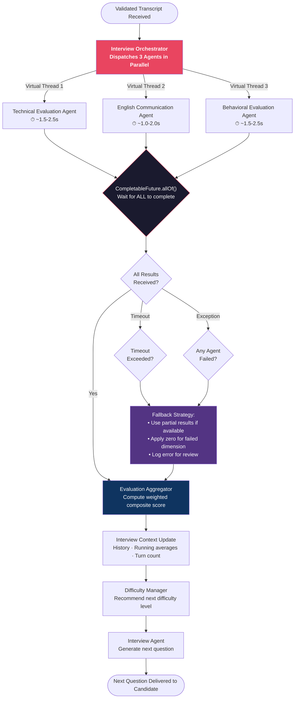
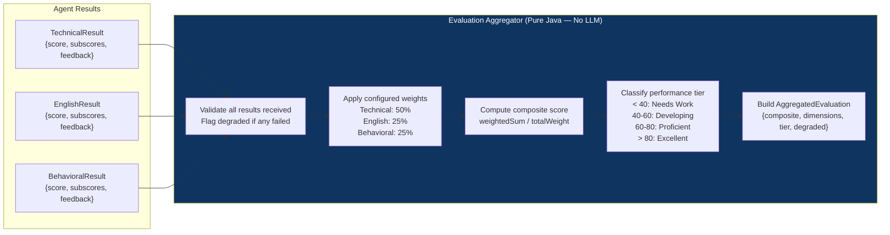

# 06 — Parallel Evaluation Architecture

> **Version:** V1 (Audio First)
> **Status:** Approved — Design Phase

---

## 1. Purpose

This document describes in detail how parallel evaluation is implemented — the concurrency model, coordination mechanism, timeout strategy, failure handling, and the full flow from transcript receipt to aggregated result.

---

## 2. Rationale for Parallel Evaluation

Evaluating a candidate's answer requires three independent assessments:
- **Technical quality** — correctness, depth, problem solving
- **Language quality** — grammar, vocabulary, fluency
- **Behavioral quality** — confidence, leadership, ownership

These assessments are completely independent of one another. Running them sequentially would triple the per-turn latency (3 × ~2s = ~6s), creating an unacceptable experience. Running them in parallel reduces the effective wait time to the slowest agent (~2s), regardless of how many agents are added in future versions.

---

## 3. Parallel Evaluation Flow Diagram



---

## 4. Concurrency Model

### 4.1 Java 21 Virtual Threads

The platform uses **Java 21 Virtual Threads** (Project Loom) for parallel agent execution. Virtual threads are:
- Lightweight — millions can exist without OS thread overhead
- Ideal for I/O-bound tasks — LLM HTTP calls are I/O-bound
- Automatically managed by the JVM scheduler

The Orchestrator submits all three agent calls to a virtual thread executor:

```
VirtualThreadExecutor executes:
  ├── CompletableFuture<TechnicalResult>  = TA.evaluate(input)
  ├── CompletableFuture<EnglishResult>    = EA.evaluate(input)
  └── CompletableFuture<BehavioralResult> = BA.evaluate(input)

CompletableFuture.allOf(techFuture, engFuture, behFuture).join()
```

### 4.2 Execution Timeline

```
t=0ms    ├─── Orchestrator dispatches all 3 agents simultaneously
         │
t=0ms    ├──────────────── Technical Agent ─────────────────┐
t=0ms    ├──────────── English Agent ─────────────────┐     │
t=0ms    ├──────────────── Behavioral Agent ───────────────┐ │
         │                                             │   │ │
t=1800ms │                                             ✓   │ │ ← English done
t=2100ms │                                                 ✓ │ ← Behavioral done
t=2400ms │                                                   ✓ ← Technical done (slowest)
         │
t=2400ms ├─── allOf() resolves → Aggregation begins
         │
t=2450ms └─── Aggregation complete → Context update + Next question
```

Effective per-turn wait = **~2.4s** (slowest agent) vs. **~6.5s** sequential

---

## 5. Timeout Strategy

Each agent call has a configurable timeout. If an agent does not return within the timeout window, its future is completed exceptionally.

| Agent | Default Timeout | Rationale |
|---|---|---|
| Technical Agent | 30 seconds | Complex prompts may require longer LLM processing |
| English Agent | 20 seconds | Simpler prompt, faster expected response |
| Behavioral Agent | 25 seconds | Moderate prompt complexity |
| Global allOf Timeout | 35 seconds | Hard ceiling before fallback is triggered |

Timeouts are externalized in `application.yml` and configurable without code changes.

---

## 6. Failure Handling Strategy

### 6.1 Failure Modes

| Failure | Trigger | Handling |
|---|---|---|
| LLM API timeout | Response not received within agent timeout | Agent returns `AgentResult` with `status=TIMEOUT`, `score=0` |
| LLM API error (5xx) | Server error from LLM provider | Retry up to 3 times with exponential backoff; fallback to score=0 |
| LLM response parse error | JSON not parseable into expected schema | Return `AgentResult` with `status=PARSE_ERROR`, `score=0` |
| Circuit breaker open | LLM provider unhealthy after repeated failures | Return `AgentResult` with `status=CIRCUIT_OPEN`, `score=0` |

### 6.2 Fallback Behavior

When any agent fails, the `EvaluationAggregator` applies a **graceful degradation strategy**:
- The failed dimension's score is recorded as `0`
- The composite score is computed with available dimensions only
- A `degradedEvaluation` flag is set on the result
- The failure is logged for system health monitoring
- The candidate is NOT notified in real-time (the interview continues)

### 6.3 Resilience4j Configuration

All LLM provider calls are wrapped in:
- **Circuit Breaker** — Opens after 5 consecutive failures; half-open after 30s
- **Retry** — Up to 3 attempts with 1s, 2s, 4s exponential backoff
- **Timeout Decorator** — Per-agent configurable timeout

---

## 7. Evaluation Aggregator Design



### 7.1 Composite Score Formula

```
compositeScore = ROUND(
    (technicalScore × w_tech + englishScore × w_eng + behavioralScore × w_beh)
    / (w_tech + w_eng + w_beh)
)
```

Default weights:

| Dimension | Weight | Rationale |
|---|---|---|
| Technical | 0.50 | Primary focus of technical interviews |
| English | 0.25 | Communication is critical for team collaboration |
| Behavioral | 0.25 | Soft skills matter for team fit |

### 7.2 Tier Classification

| Composite Score | Tier | Interpretation |
|---|---|---|
| 0 – 39 | `NEEDS_WORK` | Significant gaps; not interview-ready |
| 40 – 59 | `DEVELOPING` | Foundational knowledge present; needs practice |
| 60 – 79 | `PROFICIENT` | Strong candidate; minor improvement areas |
| 80 – 100 | `EXCELLENT` | Exceptional performance; hire-ready |

---

## 8. Per-Question vs. Final Aggregation

### 8.1 Per-Question Aggregation

After each answer, the Aggregator produces a `TurnEvaluation`:
- Individual scores per dimension
- Composite score for this turn
- Stored in the `evaluations` table
- Used by the Difficulty Manager for dynamic difficulty adjustment

### 8.2 Final Aggregation (End of Interview)

At interview completion, the Aggregator computes final scores across all turns:

```
finalTechnicalScore  = weightedAverage(turnTechnicalScores,  by questionDifficulty)
finalEnglishScore    = weightedAverage(turnEnglishScores,    by questionDifficulty)
finalBehavioralScore = weightedAverage(turnBehavioralScores, by questionDifficulty)
finalComposite       = aggregate(finalTechnical, finalEnglish, finalBehavioral)
```

Harder questions (HARD, EXPERT difficulty) are weighted more heavily than easier ones.

---

## 9. Future Scalability

| Current | Future |
|---|---|
| 3 evaluation agents (parallel) | N evaluation agents (plugin system) |
| Synchronous CompletableFuture.allOf | Async message broker (Kafka) |
| In-process agent execution | Agent microservices behind service registry |
| Fixed weight configuration | Dynamic weight profiles per interview template |
| Virtual threads (JVM) | Agent worker pools with auto-scaling |

### Adding a New Agent (V1 Procedure)

To add a fourth agent (e.g., a `PresentationStyleAgent`):

1. Implement the `EvaluationAgent` interface
2. Annotate with `@Component`
3. Add to the orchestrator's parallel execution block
4. Register with the Evaluation Aggregator
5. Update weight configuration

No existing code changes required — fully open/closed compliant.

---

## 10. Best Practices

| Practice | Implementation |
|---|---|
| **Non-blocking I/O** | Virtual threads ensure LLM calls don't block OS threads |
| **Fail-fast timeout** | Each agent has an independent timeout, not just a global one |
| **Structured fallback** | Any agent failure degrades gracefully without crashing the interview |
| **Deterministic scoring** | No randomness in aggregation; same inputs always produce same score |
| **Observability** | Each parallel execution logged with correlation ID, agent name, latency, and status |
| **Immutable results** | Agent result objects are immutable value objects (records) |
