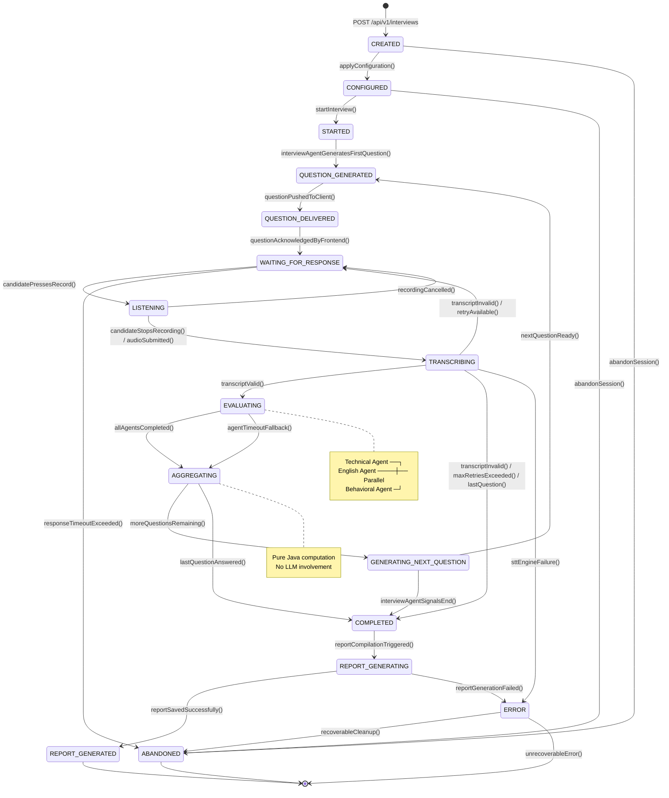
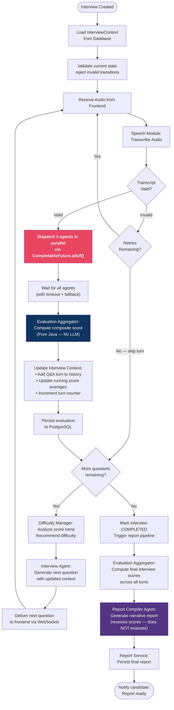

# 07 — Interview State Machine

> **Version:** V1 (Audio First)
> **Status:** Approved — Design Phase

---

## 1. Purpose

This document defines the complete interview state machine. It describes every state, the valid transitions between states, the events that trigger transitions, and the guards and actions associated with each transition. The state machine is the canonical model for interview lifecycle management.

---

## 2. Design Rationale

The interview session is **inherently stateful**. At any point in time, an interview is in exactly one state. The state machine ensures:

- **Consistency** — No invalid operations (e.g., evaluating before transcription)
- **Auditability** — Every state transition is timestamped and persisted
- **Recoverability** — Sessions can be resumed after connection drops
- **Correctness** — The Orchestrator always knows what to do next
- **Error isolation** — Invalid transitions are rejected with clear error messages

---

## 3. State Definitions

| State | Description | Who Enters This State |
|---|---|---|
| `CREATED` | Interview session record created; no configuration yet | Backend on POST /interviews |
| `CONFIGURED` | Interview domain, duration, difficulty configured | Orchestrator after config applied |
| `STARTED` | Interview officially begun; first question generated | Orchestrator on start command |
| `QUESTION_GENERATED` | Next question has been generated by Interview Agent | Orchestrator after Interview Agent responds |
| `QUESTION_DELIVERED` | Question sent to frontend and acknowledged | Orchestrator after question pushed to client |
| `LISTENING` | Frontend is actively recording candidate's audio | Frontend signals recording started |
| `TRANSCRIBING` | Audio submitted; STT engine processing | Orchestrator after audio received |
| `EVALUATING` | Parallel AI agents evaluating the transcript | Orchestrator after valid transcript received |
| `AGGREGATING` | Evaluation Aggregator computing composite scores | Orchestrator after all agents complete |
| `GENERATING_NEXT_QUESTION` | Difficulty adjusted; Interview Agent generating next question | Orchestrator after aggregation |
| `WAITING_FOR_RESPONSE` | Question delivered; waiting for candidate to begin speaking | Orchestrator after question delivery |
| `COMPLETED` | All questions answered or session ended by candidate | Orchestrator |
| `REPORT_GENERATING` | Report Compiler Agent generating narrative | Orchestrator after completion |
| `REPORT_GENERATED` | Full report persisted and ready for candidate | Orchestrator after report saved |
| `ABANDONED` | Session dropped (timeout, connection loss, explicit abort) | Orchestrator on timeout/abort |
| `ERROR` | Unrecoverable system error occurred | Orchestrator on fatal exception |

---

## 4. State Machine Diagram

---

## 5. Interview Orchestrator Flow Diagram

---

## 6. State Transition Table

| From State | Event | Guard | To State | Action |
|---|---|---|---|---|
| `CREATED` | `applyConfiguration` | Config valid | `CONFIGURED` | Persist config |
| `CREATED` | `abandonSession` | — | `ABANDONED` | Log, notify if needed |
| `CONFIGURED` | `startInterview` | Interview not expired | `STARTED` | Generate first question |
| `STARTED` | `questionGenerated` | Question not null | `QUESTION_GENERATED` | Persist question |
| `QUESTION_GENERATED` | `questionDelivered` | Client connected | `QUESTION_DELIVERED` | Start delivery timer |
| `QUESTION_DELIVERED` | `clientAcknowledged` | — | `WAITING_FOR_RESPONSE` | Start response timer |
| `WAITING_FOR_RESPONSE` | `recordingStarted` | — | `LISTENING` | Start recording timer |
| `WAITING_FOR_RESPONSE` | `responseTimeout` | Max wait exceeded | `ABANDONED` | Log timeout, cleanup |
| `LISTENING` | `audioSubmitted` | Audio size > 0 | `TRANSCRIBING` | Save audio, begin STT |
| `LISTENING` | `recordingCancelled` | — | `WAITING_FOR_RESPONSE` | Reset timer |
| `TRANSCRIBING` | `transcriptValid` | Quality checks pass | `EVALUATING` | Dispatch agents |
| `TRANSCRIBING` | `transcriptInvalid` | Retries remaining | `WAITING_FOR_RESPONSE` | Request re-answer |
| `TRANSCRIBING` | `transcriptInvalid` | Max retries exceeded | `GENERATING_NEXT_QUESTION` | Skip turn, score=0 |
| `TRANSCRIBING` | `sttFailure` | — | `ERROR` | Log, attempt recovery |
| `EVALUATING` | `allAgentsCompleted` | All futures resolved | `AGGREGATING` | Pass results to AGG |
| `EVALUATING` | `agentTimeout` | Timeout exceeded | `AGGREGATING` | Fallback partial results |
| `AGGREGATING` | `scoresComputed` | More questions remain | `GENERATING_NEXT_QUESTION` | Update context |
| `AGGREGATING` | `scoresComputed` | Last question | `COMPLETED` | Trigger report |
| `GENERATING_NEXT_QUESTION` | `questionReady` | — | `QUESTION_GENERATED` | Deliver question |
| `COMPLETED` | `reportTriggered` | — | `REPORT_GENERATING` | Invoke report agent |
| `REPORT_GENERATING` | `reportSaved` | — | `REPORT_GENERATED` | Notify candidate |
| `REPORT_GENERATING` | `reportFailed` | — | `ERROR` | Log, manual review |
| `ERROR` | `manualRecovery` | Recoverable | `ABANDONED` | Cleanup |

---

## 7. State Persistence

Every state transition is immediately persisted to the database with:
- `previousState` — the state before transition
- `currentState` — the new state
- `transitionedAt` — timestamp of transition (UTC)
- `transitionReason` — event that triggered the transition
- `transitionedBy` — system component that triggered it

This enables:
- Session recovery after server restarts
- Complete audit trail of every interview
- Debugging failed interviews by replaying state history
- Analytics on time-per-state across interviews

---

## 8. Session Recovery

If a connection drops while in `LISTENING`, `TRANSCRIBING`, or `EVALUATING`:

1. Client reconnects with the same `interviewId` + JWT
2. Orchestrator reloads session from DB
3. Current state is returned to frontend
4. Frontend re-renders appropriate UI for that state
5. If state is `TRANSCRIBING` — wait for pending STT result
6. If state is `EVALUATING` — wait for pending agent futures
7. If state is `WAITING_FOR_RESPONSE` — resume normally

Sessions in terminal states (`COMPLETED`, `REPORT_GENERATED`, `ABANDONED`) cannot be resumed.

---

## 9. Timeout Policies

| State | Timeout | Action on Timeout |
|---|---|---|
| `WAITING_FOR_RESPONSE` | 5 minutes | → `ABANDONED` |
| `LISTENING` | 3 minutes | → `WAITING_FOR_RESPONSE` (prompt re-answer) |
| `TRANSCRIBING` | 60 seconds | → `ERROR` → `ABANDONED` |
| `EVALUATING` | 35 seconds | Agent fallback, → `AGGREGATING` |
| `REPORT_GENERATING` | 120 seconds | → `ERROR` |

---

## 10. Best Practices

| Practice | Implementation |
|---|---|
| **Explicit state enum** | All states defined in a sealed `InterviewState` enum |
| **Transition validation** | Invalid transitions rejected with `IllegalStateTransitionException` |
| **Immutable transitions** | State transitions are recorded; historical states never mutated |
| **Event sourcing ready** | Design compatible with future event sourcing adoption |
| **Observer pattern** | State transitions publish domain events for loose coupling |
| **Idempotent transitions** | Re-submitting the same event in the same state is a no-op |
