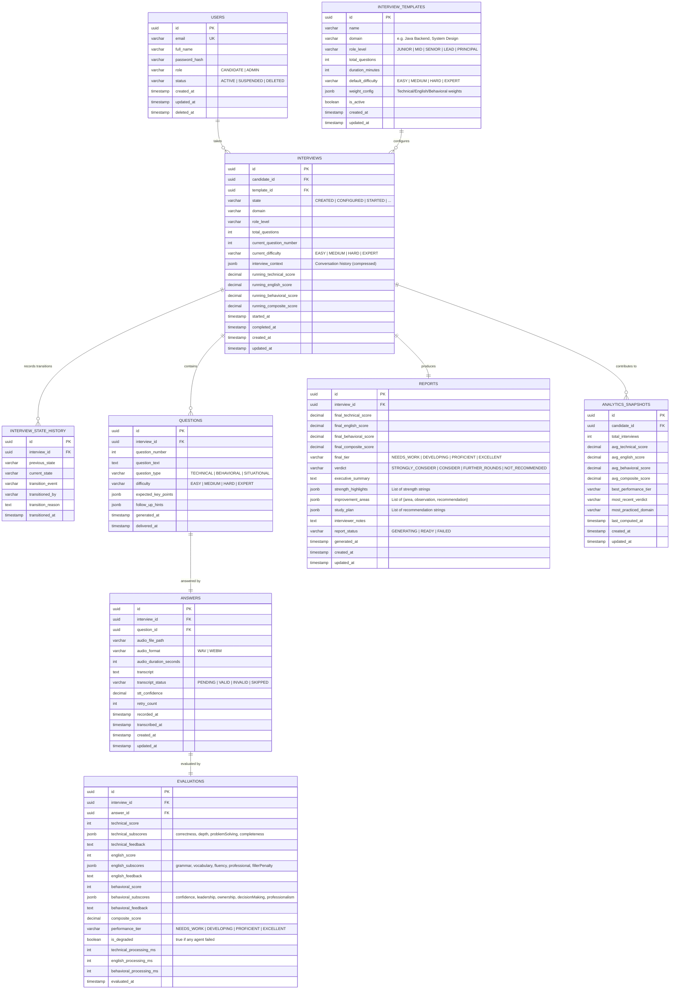

# 08 — Database Design

> **Version:** V1 (Audio First)
> **Database:** PostgreSQL 15
> **Migration Tool:** Flyway
> **Status:** Approved — Design Phase

---

## 1. Purpose

This document defines the complete relational database schema for the platform. It covers all tables, columns, constraints, indexes, relationships, and the reasoning behind every design decision. The database is the source of truth for all interview data, evaluations, and reports.

---

## 2. Design Principles

| Principle | Application |
|---|---|
| **Normalization** | 3NF minimum — no redundant data |
| **UUID Primary Keys** | All tables use UUID PKs for distributed-safe identity |
| **Soft Deletes** | No hard deletes; `deleted_at` timestamps for audit compliance |
| **Audit Columns** | `created_at`, `updated_at` on every table |
| **Enum as VARCHAR** | Interview states, difficulty levels stored as VARCHAR with CHECK constraints — readable and portable |
| **JSONB for Flexibility** | Agent results, prompts, and metadata stored as JSONB for schema flexibility |
| **Flyway Migrations** | All schema changes via versioned migration scripts |

---

## 3. Entity Relationship Diagram



---

## 4. Table Descriptions

### 4.1 `users`

Stores all registered users. Supports both candidates and administrators via the `role` column.

**Key Constraints:**
- `email` is UNIQUE and indexed
- `password_hash` stores bcrypt hash only — never plaintext
- `deleted_at` enables soft deletes without data loss

---

### 4.2 `interview_templates`

Defines reusable interview configurations. A template captures domain, role level, question count, duration, and scoring weights.

**Key Constraints:**
- `weight_config` stored as JSONB: `{"technical": 0.50, "english": 0.25, "behavioral": 0.25}`
- Templates are immutable once used by an interview (versioning planned for V2)

---

### 4.3 `interviews`

The central table representing one interview session. Tracks the full lifecycle state and running scores.

**Key Columns:**
- `state` — current interview state machine state (VARCHAR with valid values enforced by application)
- `interview_context` — JSONB storing compressed conversation history passed to agents
- `running_*_score` — rolling averages updated after each turn for real-time progress tracking

**Key Constraints:**
- FK to `users` (candidate) and `interview_templates`
- `started_at`, `completed_at` timestamps for duration computation

---

### 4.4 `interview_state_history`

Append-only audit log of every state transition. Never updated — only inserted.

**Purpose:**
- Complete state audit trail
- Session recovery debugging
- Analytics on average time-per-state

---

### 4.5 `questions`

One record per question generated during an interview. Stores the question text, type, difficulty, and the key points the Interview Agent expected in the answer.

**Key Columns:**
- `expected_key_points` — JSONB array used by Technical Agent for completeness scoring
- `delivered_at` — timestamp when question was pushed to the client

---

### 4.6 `answers`

One record per candidate answer. Stores the audio file path, transcript, STT confidence, and retry count.

**Key Columns:**
- `audio_file_path` — relative path to stored audio file
- `transcript_status` — VALID, INVALID, or SKIPPED
- `stt_confidence` — confidence score from STT engine (0.0–1.0)
- `retry_count` — how many times the candidate was asked to re-answer

---

### 4.7 `evaluations`

One record per evaluated answer. Stores all agent scores, subscores, feedback, and the computed composite score.

**Key Columns:**
- `technical_subscores`, `english_subscores`, `behavioral_subscores` — JSONB maps for detailed sub-dimension scores
- `is_degraded` — flags evaluations where one or more agents failed (partial data)
- `*_processing_ms` — latency tracking per agent for performance monitoring

---

### 4.8 `reports`

One record per completed interview. The final assessment report including all aggregate scores, narrative content, and verdict.

**Key Columns:**
- `verdict` — hire recommendation tier (computed by backend, not LLM)
- `executive_summary`, `strength_highlights`, `improvement_areas`, `study_plan` — LLM-generated narrative content
- `report_status` — GENERATING → READY or FAILED

---

### 4.9 `analytics_snapshots`

Pre-computed analytics per candidate, updated after each interview. Enables fast dashboard queries without expensive aggregations.

---

## 5. Index Strategy

```sql
-- Performance-critical indexes

-- Frequent queries: candidate's interview list
CREATE INDEX idx_interviews_candidate_id ON interviews(candidate_id);

-- State filtering (admin dashboards, health checks)
CREATE INDEX idx_interviews_state ON interviews(state);

-- Question retrieval by interview (ordered)
CREATE INDEX idx_questions_interview_id ON questions(interview_id, question_number);

-- Answer lookup by interview and question
CREATE INDEX idx_answers_interview_question ON answers(interview_id, question_id);

-- Evaluation lookup by answer
CREATE INDEX idx_evaluations_answer_id ON evaluations(answer_id);

-- Report lookup by interview
CREATE INDEX idx_reports_interview_id ON reports(interview_id);

-- State history ordered by interview
CREATE INDEX idx_state_history_interview_time ON interview_state_history(interview_id, transitioned_at);

-- Analytics by candidate
CREATE INDEX idx_analytics_candidate_id ON analytics_snapshots(candidate_id);
```

---

## 6. JSONB Column Designs

### `interview_context` (interviews table)

```json
{
  "turns": [
    {
      "questionNumber": 1,
      "questionText": "Explain Java garbage collection...",
      "transcript": "Java uses automatic memory management...",
      "compositeScore": 72,
      "difficulty": "MEDIUM"
    }
  ],
  "topicsDiscussed": ["garbage collection", "threading"],
  "averageScore": 74.5
}
```

### `technical_subscores` (evaluations table)

```json
{
  "correctness": 80,
  "depth": 70,
  "problemSolving": 65,
  "completeness": 55
}
```

### `improvement_areas` (reports table)

```json
[
  {
    "area": "Concurrency — Thread Safety",
    "observation": "Candidate described synchronization superficially...",
    "recommendation": "Study java.util.concurrent package and practice..."
  }
]
```

---

## 7. Migration Strategy (Flyway)

All schema changes are applied through versioned Flyway migration scripts:

```
backend/src/main/resources/db/migration/
├── V1__create_users_table.sql
├── V2__create_interview_templates_table.sql
├── V3__create_interviews_table.sql
├── V4__create_interview_state_history_table.sql
├── V5__create_questions_table.sql
├── V6__create_answers_table.sql
├── V7__create_evaluations_table.sql
├── V8__create_reports_table.sql
├── V9__create_analytics_snapshots_table.sql
└── V10__create_indexes.sql
```

**Rules:**
- Migration scripts are immutable once merged to main
- Backward-compatible changes only (additive)
- Breaking changes require new table version or multi-step migration

---

## 8. Data Retention Policy

| Data Type | Retention | Justification |
|---|---|---|
| Audio files | 30 days (configurable) | Privacy; deleted after report generation confirmed |
| Transcripts | Indefinitely | Part of evaluation record |
| Evaluation data | Indefinitely | Analytics and candidate progress tracking |
| Reports | Indefinitely | Candidate's right to access their assessment |
| State history | 1 year | Audit compliance; archived to cold storage after |

---

## 9. Future Scalability

| Concern | Strategy |
|---|---|
| Read-heavy dashboard queries | PostgreSQL read replicas; Redis caching of `analytics_snapshots` |
| Large `interview_context` JSONB | Archive old turns to `answer_context_archive` table; send only last N turns to agents |
| Audit log growth | Partition `interview_state_history` by month |
| Multi-tenancy (V3) | Add `tenant_id` to all tables; row-level security policies |
| Time-series analytics | Migrate `analytics_snapshots` to TimescaleDB extension |
