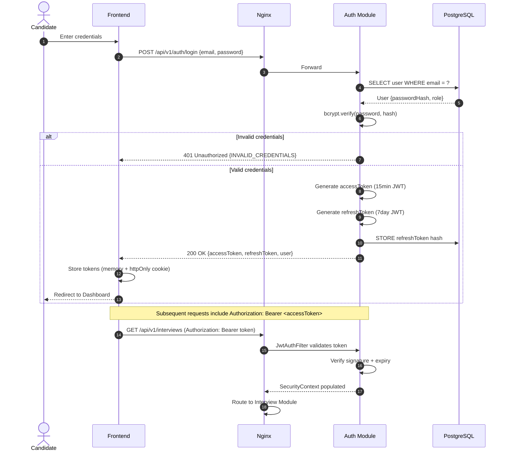

# 09 — API Design

> **Version:** V1 (Audio First)
> **Base URL:** `/api/v1`
> **Auth:** Bearer JWT
> **Status:** Approved — Design Phase

---

## 1. Purpose

This document defines the complete API surface of the platform — REST endpoints, WebSocket channels, request/response contracts, error handling conventions, and versioning strategy. It serves as the authoritative reference for frontend-backend integration.

---

## 2. API Design Principles

| Principle | Implementation |
|---|---|
| **RESTful Resources** | Nouns as resource paths; HTTP verbs for actions |
| **Consistent Responses** | All responses wrapped in a standard envelope |
| **HTTP Status Codes** | Semantically correct status codes for every outcome |
| **Versioning** | URL-based versioning (`/api/v1/...`) |
| **Pagination** | Cursor-based pagination for list endpoints |
| **OpenAPI 3.0** | Auto-generated via SpringDoc; accessible at `/api-docs` |
| **HATEOAS** | Not used in V1 (added in V2 if needed) |

---

## 3. Standard Response Envelope

All API responses share a consistent envelope structure:

**Success Response:**
```json
{
  "success": true,
  "data": { },
  "timestamp": "2026-07-01T18:00:00Z",
  "requestId": "uuid"
}
```

**Error Response:**
```json
{
  "success": false,
  "error": {
    "code": "INTERVIEW_NOT_FOUND",
    "message": "Interview with id 'abc' does not exist",
    "details": { }
  },
  "timestamp": "2026-07-01T18:00:00Z",
  "requestId": "uuid"
}
```

---

## 4. Authentication Flow Diagram



---

## 5. REST API Reference

### 5.1 Auth Module

#### `POST /api/v1/auth/register`
Register a new candidate account.

```
Request Body:
{
  "fullName": "string",
  "email": "string",
  "password": "string (min 8 chars)"
}

Response 201:
{
  "data": {
    "user": { "id": "uuid", "email": "...", "fullName": "..." }
  }
}

Errors:
  409 — EMAIL_ALREADY_EXISTS
  400 — VALIDATION_ERROR
```

---

#### `POST /api/v1/auth/login`
Authenticate and receive JWT tokens.

```
Request Body:
{ "email": "string", "password": "string" }

Response 200:
{
  "data": {
    "accessToken": "eyJ...",
    "refreshToken": "eyJ...",
    "expiresIn": 900,
    "user": { "id": "uuid", "email": "...", "fullName": "...", "role": "CANDIDATE" }
  }
}

Errors:
  401 — INVALID_CREDENTIALS
  423 — ACCOUNT_SUSPENDED
```

---

#### `POST /api/v1/auth/refresh`
Exchange refresh token for new access token.

```
Request Body:
{ "refreshToken": "string" }

Response 200:
{
  "data": {
    "accessToken": "eyJ...",
    "expiresIn": 900
  }
}

Errors:
  401 — INVALID_REFRESH_TOKEN
  401 — REFRESH_TOKEN_EXPIRED
```

---

#### `POST /api/v1/auth/logout`
🔒 Authenticated — Invalidate refresh token.

```
Response 204: No Content

Errors:
  401 — UNAUTHORIZED
```

---

### 5.2 User Module

#### `GET /api/v1/users/me`
🔒 Authenticated — Retrieve the authenticated candidate's profile.

```
Response 200:
{
  "data": {
    "id": "uuid",
    "email": "...",
    "fullName": "...",
    "role": "CANDIDATE",
    "createdAt": "2026-07-01T..."
  }
}
```

---

#### `PUT /api/v1/users/me`
🔒 Authenticated — Update candidate profile.

```
Request Body:
{ "fullName": "string" }

Response 200:
{
  "data": { "id": "uuid", "fullName": "..." }
}

Errors:
  400 — VALIDATION_ERROR
```

---

### 5.3 Interview Module

#### `POST /api/v1/interviews`
🔒 Authenticated — Create a new interview session.

```
Request Body:
{
  "templateId": "uuid (optional — use defaults if absent)",
  "domain": "string (e.g. 'Java Backend')",
  "roleLevel": "JUNIOR | MID | SENIOR | LEAD | PRINCIPAL",
  "totalQuestions": 10,
  "durationMinutes": 30
}

Response 201:
{
  "data": {
    "interviewId": "uuid",
    "state": "CREATED",
    "domain": "Java Backend",
    "roleLevel": "SENIOR",
    "totalQuestions": 10
  }
}

Errors:
  400 — VALIDATION_ERROR
  404 — TEMPLATE_NOT_FOUND
```

---

#### `POST /api/v1/interviews/{id}/start`
🔒 Authenticated — Start the interview session. Returns the first question.

```
Response 200:
{
  "data": {
    "interviewId": "uuid",
    "state": "QUESTION_DELIVERED",
    "question": {
      "id": "uuid",
      "number": 1,
      "text": "Explain the concept of...",
      "type": "TECHNICAL",
      "difficulty": "MEDIUM",
      "totalQuestions": 10
    }
  }
}

Errors:
  409 — INTERVIEW_ALREADY_STARTED
  404 — INTERVIEW_NOT_FOUND
  403 — FORBIDDEN (not owner)
```

---

#### `POST /api/v1/interviews/{id}/answers`
🔒 Authenticated — Submit an audio answer. Multipart form data.

```
Request (multipart/form-data):
  audio:       binary  — audio file (WAV or WebM)
  questionId:  string  — UUID of the current question

Response 200:
{
  "data": {
    "answerId": "uuid",
    "state": "TRANSCRIBING",
    "message": "Answer received. Processing..."
  }
}

Errors:
  400 — INVALID_AUDIO_FORMAT
  400 — AUDIO_TOO_SHORT
  400 — AUDIO_TOO_LARGE (> 25MB)
  409 — INVALID_STATE_FOR_ANSWER
```

---

#### `GET /api/v1/interviews/{id}`
🔒 Authenticated — Get current interview session state.

```
Response 200:
{
  "data": {
    "interviewId": "uuid",
    "state": "WAITING_FOR_RESPONSE",
    "currentQuestionNumber": 3,
    "totalQuestions": 10,
    "currentDifficulty": "HARD",
    "runningCompositeScore": 74.5,
    "startedAt": "2026-07-01T18:00:00Z"
  }
}
```

---

#### `POST /api/v1/interviews/{id}/end`
🔒 Authenticated — Manually end the interview early.

```
Response 200:
{
  "data": {
    "interviewId": "uuid",
    "state": "COMPLETED",
    "message": "Interview ended. Report generation triggered."
  }
}

Errors:
  409 — INTERVIEW_ALREADY_COMPLETED
```

---

#### `GET /api/v1/interviews`
🔒 Authenticated — List all interviews for the authenticated candidate.

```
Query Parameters:
  page: int (default 0)
  size: int (default 10, max 50)
  state: string (optional filter)

Response 200:
{
  "data": {
    "interviews": [
      {
        "id": "uuid",
        "domain": "Java Backend",
        "state": "REPORT_GENERATED",
        "compositeScore": 74,
        "completedAt": "2026-07-01T..."
      }
    ],
    "page": 0,
    "size": 10,
    "totalElements": 23,
    "totalPages": 3
  }
}
```

---

### 5.4 Report Module

#### `GET /api/v1/reports/{interviewId}`
🔒 Authenticated — Retrieve the full assessment report.

```
Response 200:
{
  "data": {
    "reportId": "uuid",
    "interviewId": "uuid",
    "generatedAt": "2026-07-01T...",
    "scores": {
      "technical": 72.5,
      "english": 83.0,
      "behavioral": 68.0,
      "composite": 74.0,
      "tier": "PROFICIENT"
    },
    "verdict": "CONSIDER",
    "executiveSummary": "...",
    "strengthHighlights": ["...", "..."],
    "improvementAreas": [
      {
        "area": "Concurrency",
        "observation": "...",
        "recommendation": "..."
      }
    ],
    "studyPlan": ["...", "..."],
    "questionBreakdown": [
      {
        "questionNumber": 1,
        "questionText": "...",
        "compositeScore": 78,
        "technicalScore": 80,
        "englishScore": 90,
        "behavioralScore": 65
      }
    ]
  }
}

Errors:
  404 — REPORT_NOT_FOUND
  409 — REPORT_STILL_GENERATING
  403 — FORBIDDEN
```

---

#### `GET /api/v1/reports/{interviewId}/export`
🔒 Authenticated — Export report as PDF.

```
Response 200:
  Content-Type: application/pdf
  Body: PDF binary

Errors:
  404 — REPORT_NOT_FOUND
  503 — EXPORT_TEMPORARILY_UNAVAILABLE
```

---

### 5.5 Dashboard Module

#### `GET /api/v1/dashboard/summary`
🔒 Authenticated — Retrieve the candidate's dashboard summary.

```
Response 200:
{
  "data": {
    "totalInterviews": 12,
    "averageCompositeScore": 71.4,
    "averageTechnicalScore": 68.2,
    "averageEnglishScore": 78.5,
    "averageBehavioralScore": 67.3,
    "bestPerformanceTier": "PROFICIENT",
    "mostPracticedDomain": "Java Backend",
    "recentInterviews": [ { ... } ]
  }
}
```

---

### 5.6 Analytics Module

#### `GET /api/v1/analytics/performance`
🔒 Authenticated — Score trends over time for charts.

```
Query Parameters:
  domain: string (optional)
  from:   date (ISO 8601)
  to:     date (ISO 8601)

Response 200:
{
  "data": {
    "trendPoints": [
      {
        "interviewDate": "2026-06-01",
        "compositeScore": 68,
        "technicalScore": 65,
        "englishScore": 75,
        "behavioralScore": 64
      }
    ]
  }
}
```

---

## 6. WebSocket API

### 6.1 WebSocket Endpoint

```
ws://host/ws/interview
Protocol: STOMP over SockJS
Authentication: JWT passed as query param or STOMP CONNECT header
```

### 6.2 Subscription Topics

| Topic | Direction | Payload | Description |
|---|---|---|---|
| `/topic/interview/{id}/state` | Server → Client | `{state, timestamp}` | State machine transition updates |
| `/topic/interview/{id}/question` | Server → Client | `{question, number, difficulty}` | Next question delivery |
| `/topic/interview/{id}/evaluation` | Server → Client | `{compositeScore, tier}` | Real-time score update after evaluation |
| `/topic/interview/{id}/report-ready` | Server → Client | `{reportId}` | Report generation complete |
| `/app/interview/{id}/recording-start` | Client → Server | `{questionId}` | Signals candidate started recording |
| `/app/interview/{id}/recording-stop` | Client → Server | `{questionId}` | Signals candidate stopped recording |

---

## 7. Error Code Reference

| HTTP Status | Error Code | Description |
|---|---|---|
| 400 | `VALIDATION_ERROR` | Request body fails validation |
| 400 | `INVALID_AUDIO_FORMAT` | Unsupported audio format submitted |
| 400 | `AUDIO_TOO_SHORT` | Audio clip too brief for transcription |
| 400 | `AUDIO_TOO_LARGE` | Audio exceeds size limit |
| 401 | `UNAUTHORIZED` | Missing or invalid JWT |
| 401 | `INVALID_CREDENTIALS` | Wrong email or password |
| 401 | `REFRESH_TOKEN_EXPIRED` | Refresh token has expired |
| 403 | `FORBIDDEN` | Authenticated but not authorized for this resource |
| 404 | `INTERVIEW_NOT_FOUND` | Interview ID does not exist |
| 404 | `REPORT_NOT_FOUND` | Report not yet generated or doesn't exist |
| 409 | `INTERVIEW_ALREADY_STARTED` | Cannot start an already-started interview |
| 409 | `INVALID_STATE_FOR_ANSWER` | Interview not in WAITING_FOR_RESPONSE state |
| 409 | `REPORT_STILL_GENERATING` | Report requested before it's ready |
| 429 | `RATE_LIMIT_EXCEEDED` | Too many requests from this client |
| 500 | `INTERNAL_SERVER_ERROR` | Unhandled server error |
| 503 | `SERVICE_TEMPORARILY_UNAVAILABLE` | LLM or STT service unavailable |

---

## 8. Rate Limiting

| Endpoint Group | Limit | Window |
|---|---|---|
| `POST /auth/login` | 5 requests | 1 minute |
| `POST /auth/register` | 3 requests | 1 hour |
| `POST /interviews/*/answers` | 20 requests | 1 minute |
| All other authenticated | 100 requests | 1 minute |

Rate limits enforced at Nginx level (V1) and optionally at Spring application level via bucket4j (V2).

---

## 9. API Versioning Strategy

| Version | Path | Status |
|---|---|---|
| V1 | `/api/v1/...` | **Current** |
| V2 | `/api/v2/...` | Planned — Video analysis, richer report format |

Breaking changes require a new version. V1 will be maintained until all clients have migrated to V2.

---

## 10. OpenAPI Documentation

The full machine-readable OpenAPI 3.0 spec is auto-generated by SpringDoc and available at:

| URL | Description |
|---|---|
| `/api-docs` | Raw OpenAPI JSON specification |
| `/swagger-ui.html` | Interactive Swagger UI |

Available in development and staging environments. Disabled in production by default (configurable).
