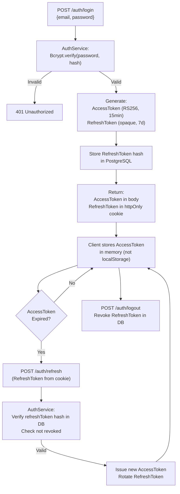
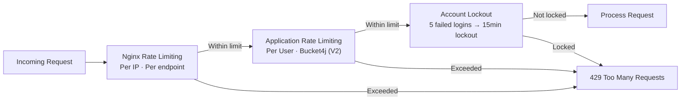

# 10 — Security Design

> **Version:** V1 (Audio First)
> **Framework:** Spring Security 6
> **Auth:** JWT (RS256)
> **Status:** Approved — Design Phase

---

## 1. Purpose

This document defines the complete security architecture of the platform — authentication model, authorization strategy, data protection measures, API security controls, and compliance considerations. Security is treated as a first-class architectural concern, not an afterthought.

---

## 2. Security Threat Model

### 2.1 Identified Threats (STRIDE)

| Threat | Example | Mitigation |
|---|---|---|
| **Spoofing** | Impersonating another candidate | JWT signature verification, strong password hashing |
| **Tampering** | Modifying audio files or transcripts | Audio file checksums; DB records immutable after write |
| **Repudiation** | Denying interview actions | Audit log (state history), timestamped records |
| **Information Disclosure** | Accessing another candidate's report | Ownership checks on every resource access |
| **Denial of Service** | Flooding the audio upload endpoint | Rate limiting, request size limits, Nginx layer protection |
| **Elevation of Privilege** | Candidate accessing admin functions | Role-based authorization on every endpoint |

---

## 3. Authentication Architecture

### 3.1 Token Strategy

The platform uses **asymmetric JWT (RS256)**:
- **Private key** — held by the backend, signs access tokens
- **Public key** — used to verify tokens; can be shared with future service consumers

| Token | Lifetime | Storage |
|---|---|---|
| Access Token | 15 minutes | Browser memory (never localStorage) |
| Refresh Token | 7 days | HTTP-only, Secure, SameSite=Strict cookie |

### 3.2 Token Payload (Access Token)

```json
{
  "sub": "uuid (userId)",
  "email": "candidate@example.com",
  "role": "CANDIDATE",
  "iat": 1720000000,
  "exp": 1720000900,
  "jti": "unique-token-id"
}
```

### 3.3 Refresh Token Rotation

On every refresh:
1. Old refresh token is invalidated (hash removed from DB)
2. A new refresh token is issued and stored
3. This prevents refresh token reuse even if intercepted

### 3.4 Authentication Flow Diagram



---

## 4. Authorization Model

### 4.1 Roles

| Role | Description | Access Level |
|---|---|---|
| `CANDIDATE` | Registered interview taker | Own interviews, own reports, own profile |
| `ADMIN` | Platform operator | All resources; user management; templates |

### 4.2 Authorization Rules

| Resource | CANDIDATE | ADMIN |
|---|---|---|
| Own interview sessions | Full CRUD | Full CRUD |
| Another candidate's interview | ❌ Forbidden | ✅ Read only |
| Own reports | Read + Export | Full access |
| Another candidate's reports | ❌ Forbidden | ✅ Read only |
| Interview templates | Read only | Full CRUD |
| User management | ❌ | Full CRUD |
| Analytics | Own data only | All candidates |

### 4.3 Ownership Enforcement

Every data-access service method performs an ownership check:

```
Before returning interview data:
  assert interview.candidateId == authenticatedUserId
  OR authenticatedUserRole == ADMIN
  → throw ForbiddenException if check fails
```

This is enforced at the **service layer**, not just the controller, providing defense-in-depth.

---

## 5. Request Security

### 5.1 Input Validation

All incoming request bodies are validated using **Bean Validation (JSR-380)**:
- Null checks on required fields
- String length constraints
- Enum value validation
- Regex patterns for structured fields (email, UUIDs)

Validation errors return `400 BAD_REQUEST` with detailed field-level error messages.

### 5.2 Audio Upload Security

Audio submissions are treated as untrusted binary inputs:

| Control | Implementation |
|---|---|
| **File size limit** | Max 25 MB enforced by Spring + Nginx |
| **Format validation** | Magic bytes inspection (not just filename extension) |
| **Virus scanning** | ClamAV integration (V2) |
| **Path traversal prevention** | Audio stored with UUID-based filenames, not user-supplied names |
| **Isolated storage** | Audio files stored outside the web root |

### 5.3 SQL Injection Prevention

- All database access via Spring Data JPA with parameterized queries
- No string-concatenated SQL queries anywhere in the codebase
- JPA/Hibernate handles all query parameterization

### 5.4 Content Security

| Header | Value | Purpose |
|---|---|---|
| `Content-Security-Policy` | `default-src 'self'` | Prevent XSS via inline scripts |
| `X-Frame-Options` | `DENY` | Prevent clickjacking |
| `X-Content-Type-Options` | `nosniff` | Prevent MIME sniffing |
| `Strict-Transport-Security` | `max-age=31536000; includeSubDomains` | Enforce HTTPS |
| `Referrer-Policy` | `strict-origin-when-cross-origin` | Limit referrer leakage |

All headers applied globally via Spring Security's `HeadersConfigurer`.

---

## 6. Transport Security

- **HTTPS only** — All traffic encrypted via TLS 1.3
- **TLS termination** — Handled at Nginx layer
- **HTTP → HTTPS redirect** — Enforced at Nginx
- **HSTS** — Strict Transport Security header with 1-year max-age
- **WebSocket** — WSS (WebSocket Secure) only

---

## 7. CORS Policy

```
Allowed Origins:    https://app.yourdomain.com (production)
                    http://localhost:3000 (development only)
Allowed Methods:    GET, POST, PUT, DELETE, OPTIONS
Allowed Headers:    Authorization, Content-Type, X-Request-Id
Exposed Headers:    X-Total-Count
Allow Credentials:  true
Max Age:            3600 seconds
```

CORS configured in Spring Security's `CorsConfigurer`. Nginx enforces an additional CORS layer.

---

## 8. Secrets Management

| Secret | V1 Storage | V2+ Storage |
|---|---|---|
| JWT private/public keys | Environment variables | HashiCorp Vault |
| Database credentials | Environment variables | Vault dynamic secrets |
| LLM API keys | Environment variables | Vault with rotation |
| Refresh token secret | Environment variables | Vault |
| SMTP credentials | Environment variables | Vault |

**Rules:**
- No secrets in source code
- No secrets in Docker images
- No secrets in application.yml committed to git
- `application.yml` references `${ENV_VAR}` placeholders only

---

## 9. Rate Limiting and Brute Force Protection



---

## 10. Audit Logging

All security-relevant events are logged with:
- Timestamp (UTC)
- Actor (userId or "anonymous")
- Action performed
- Resource affected
- IP address
- Request ID
- Outcome (SUCCESS / FAILURE)

**Logged Events:**
- Login attempts (success and failure)
- Token refresh
- Logout
- Interview creation, start, and termination
- Report access
- All 401/403 responses
- Admin actions

Logs are structured JSON (Logback) for ingestion into log aggregation systems (ELK Stack, Loki — future).

---

## 11. Data Privacy

| Concern | Implementation |
|---|---|
| **Audio Privacy** | Audio never sent to cloud; local STT only |
| **Audio Retention** | Files deleted after configurable period (default: 30 days) |
| **Password Storage** | BCrypt with cost factor 12 |
| **PII Minimization** | Only email + name collected; no location, phone, or device data |
| **Data Access** | Candidates access only their own data (ownership enforced) |
| **Right to Delete** | Soft delete + data purge on explicit request (GDPR compliance path) |

---

## 12. Security Best Practices Summary

| Category | Practice |
|---|---|
| Auth | RS256 JWT, short-lived access tokens, refresh token rotation |
| Secrets | Environment variables → Vault, never hardcoded |
| Transport | TLS 1.3, HSTS, HTTPS-only |
| Input | Bean Validation, parameterized queries, file magic byte checks |
| Headers | Full security header suite via Spring Security |
| Rate Limiting | Nginx + application-level, login lockout |
| Audit | Structured JSON security event logging |
| Privacy | Local STT, audio purge, PII minimization |
| Ownership | Service-layer ownership checks on all data access |
