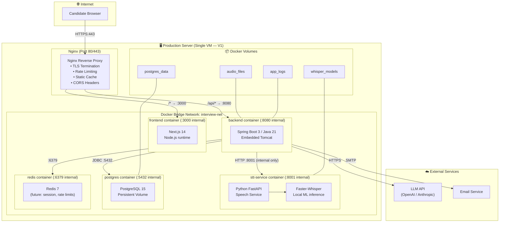
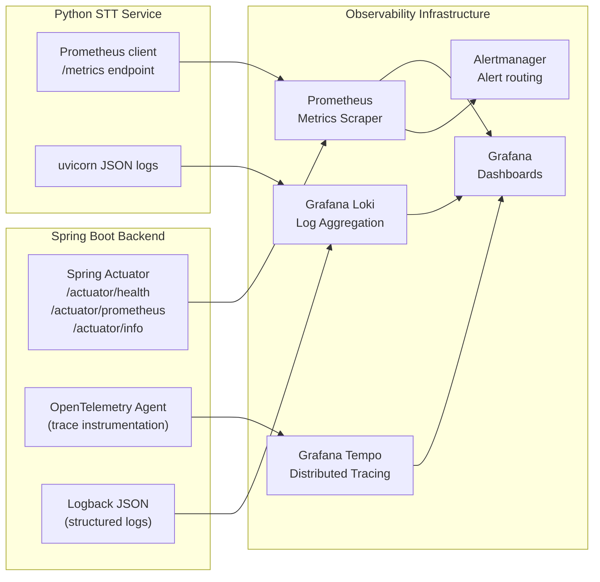
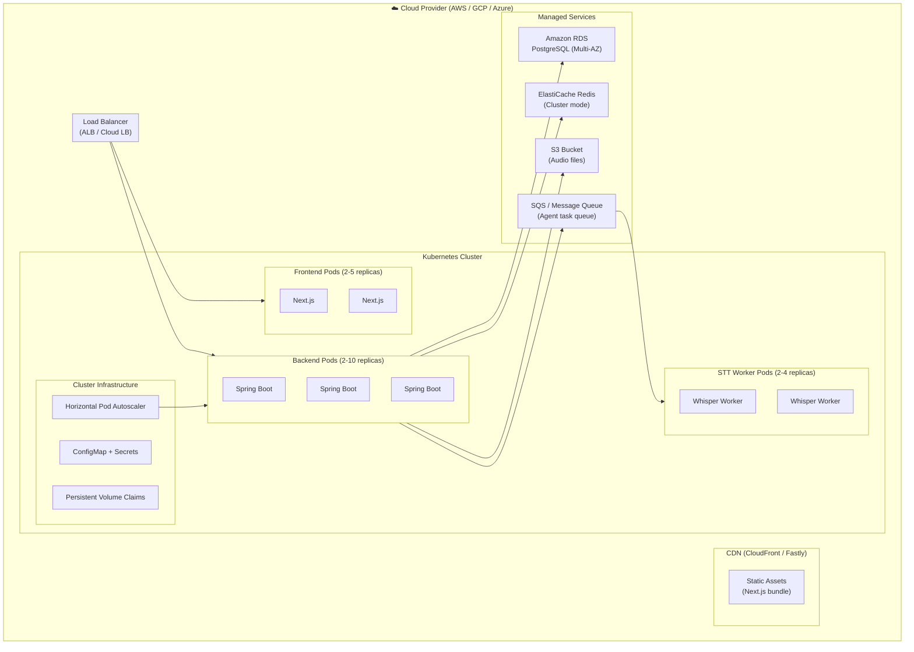

# 11 — Deployment Architecture

> **Version:** V1 (Audio First)
> **Containerization:** Docker + Docker Compose
> **CI/CD:** GitHub Actions
> **Last Updated:** Architecture Review — Changes 1, 9, 10
> **Status:** Approved — Updated

---

## 1. Purpose

This document defines the deployment architecture for the platform — from local development to production. It covers containerization, orchestration, CI/CD pipelines, environment strategy, infrastructure configuration, and the path to cloud-native deployment.

---

## 2. Environment Strategy

| Environment | Purpose | Infrastructure | LLM Provider | STT Provider |
|---|---|---|---|---|
| **Local (dev)** | Developer machines | Docker Compose | Local Ollama or mock | Faster-Whisper local |
| **CI** | Automated tests | GitHub Actions + Docker | Mock LLM stub | Mock STT stub |
| **Staging** | Pre-production validation | Single VM + Docker Compose | OpenAI (test keys) | Faster-Whisper local |
| **Production** | Live system | Kubernetes (V2) / Single server (V1) | OpenAI / Anthropic | Faster-Whisper local |

---

## 3. V1 Deployment Architecture Diagram *(Updated — Change 10)*



> **Key Change:** The Python FastAPI STT service runs as a separate container on the internal Docker network. It is **not routed through Nginx** and is not accessible from outside the VM. Spring Boot communicates with it via `http://stt-service:8001`.

---

## 4. Docker Compose Configuration

### 4.1 Service Summary *(Updated — Change 10)*

| Service | Image | Port | Dependencies | Purpose |
|---|---|---|---|---|
| `nginx` | `nginx:alpine` | `80, 443` | `frontend`, `backend` | TLS, routing, rate limiting |
| `frontend` | `node:20-alpine` (custom) | `3000` (internal) | — | Next.js UI |
| `backend` | `eclipse-temurin:21` (custom) | `8080` (internal) | `postgres`, `redis`, `stt-service` | Spring Boot API |
| `stt-service` | `python:3.11-slim` (custom) | `8001` (internal) | — | Python FastAPI + Faster-Whisper |
| `postgres` | `postgres:15-alpine` | `5432` (internal) | — | Primary database |
| `redis` | `redis:7-alpine` | `6379` (internal) | — | Cache (future) |

### 4.2 Volume Strategy

| Volume | Mount Path (container) | Purpose |
|---|---|---|
| `postgres_data` | `/var/lib/postgresql/data` | Database persistence |
| `audio_files` | `/app/audio` (backend) | Candidate audio storage |
| `whisper_models` | `/app/models` (stt-service) | Faster-Whisper model weights |
| `app_logs` | `/app/logs` (backend) | Structured JSON logs |
| `stt_logs` | `/app/logs` (stt-service) | STT service request logs |

### 4.3 Network Design

All containers communicate on an internal Docker bridge network `interview-net`. Only Nginx exposes ports to the host. Backend and database are not publicly accessible.

---

## 5. Container Build Strategy

### 5.1 Backend Dockerfile (Multi-Stage)

```
Stage 1 — Build:
  FROM maven:3.9-eclipse-temurin-21 AS builder
  COPY pom.xml + src/
  RUN mvn package -DskipTests

Stage 2 — Runtime:
  FROM eclipse-temurin:21-jre-jammy
  COPY --from=builder target/*.jar app.jar
  RUN addgroup --system appgroup && adduser --system appuser --ingroup appgroup
  USER appuser
  ENTRYPOINT ["java", "-jar", "/app.jar"]
```

**Security hardening:**
- Non-root user inside container
- No shell in production image
- Read-only root filesystem (except `/tmp` and `/app/audio`)

### 5.2 Frontend Dockerfile (Multi-Stage)

```
Stage 1 — Build:
  FROM node:20-alpine AS builder
  COPY package.json + source
  RUN npm ci && npm run build

Stage 2 — Runtime:
  FROM node:20-alpine AS runner
  COPY --from=builder .next/standalone ./
  COPY --from=builder .next/static ./.next/static
  USER node
  CMD ["node", "server.js"]
```

### 5.3 Python STT Service Dockerfile *(New — Change 1)*

```
Stage 1 — Build:
  FROM python:3.11-slim AS builder
  RUN pip install faster-whisper fastapi uvicorn[standard]
  COPY requirements.txt + src/

Stage 2 — Runtime:
  FROM python:3.11-slim
  COPY --from=builder /app ./
  RUN adduser --system sttuser
  USER sttuser
  CMD ["uvicorn", "main:app", "--host", "0.0.0.0", "--port", "8001"]
```

**Key design points:**
- Exposes only port 8001 on internal Docker network
- Whisper model weights pre-loaded from mounted volume at startup
- No public-facing port — Nginx does not route to this service
- Configurable model size: `tiny`, `base`, `small`, `medium`, `large-v3`

---

## 6. CI/CD Pipeline

### 6.1 Pipeline Diagram

```mermaid
flowchart LR
    DEV["Developer\nPushes to branch"]
    PR["Pull Request\nOpened"]

    subgraph CI["GitHub Actions — CI Pipeline"]
        LINT["Lint & Format\nCheckstyle · ESLint · Prettier"]
        UNIT["Unit Tests\nJUnit 5 · Jest"]
        INT["Integration Tests\nTestcontainers\n(PostgreSQL + Redis)"]
        BUILD_BACK["Build Backend\nmvn package"]
        BUILD_FRONT["Build Frontend\nnpm run build"]
        DOCKER_BUILD["Docker Build\nBoth images"]
        SCAN["Security Scan\nTrivy (image) · OWASP (deps)"]
    end

    subgraph CD_STAGING["GitHub Actions — CD Staging"]
        DEPLOY_STAGE["Deploy to Staging\ndocker-compose up"]
        SMOKE["Smoke Tests\nHealth endpoints"]
    end

    subgraph CD_PROD["GitHub Actions — CD Production"]
        MANUAL_APPROVE["Manual Approval\nRequired"]
        DEPLOY_PROD["Deploy to Production\ndocker-compose up"]
        HEALTH["Health Check\nPost-deploy validation"]
        ROLLBACK["Auto-rollback\non failure"]
    end

    DEV --> PR
    PR --> LINT
    LINT --> UNIT
    UNIT --> INT
    INT --> BUILD_BACK
    INT --> BUILD_FRONT
    BUILD_BACK --> DOCKER_BUILD
    BUILD_FRONT --> DOCKER_BUILD
    DOCKER_BUILD --> SCAN
    SCAN -->|"Merge to main"| DEPLOY_STAGE
    DEPLOY_STAGE --> SMOKE
    SMOKE -->|"Success + Manual Gate"| MANUAL_APPROVE
    MANUAL_APPROVE --> DEPLOY_PROD
    DEPLOY_PROD --> HEALTH
    HEALTH -->|"Failure"| ROLLBACK
```



### 6.2 GitHub Actions Workflows

| Workflow File | Trigger | Purpose |
|---|---|---|
| `ci.yml` | PR + push to main | Full CI: lint, test, build, scan |
| `deploy-staging.yml` | Push to main | Auto-deploy to staging |
| `deploy-production.yml` | Manual dispatch | Production deployment with gate |
| `security-scan.yml` | Weekly schedule | OWASP dependency check + Trivy |

---

## 7. Health Checks

Spring Boot Actuator exposes health endpoints used by Docker and CI/CD:

| Endpoint | Path | Purpose |
|---|---|---|
| Liveness | `/actuator/health/liveness` | Is the app alive? |
| Readiness | `/actuator/health/readiness` | Is the app ready to serve traffic? |
| Detailed health | `/actuator/health` | DB, Redis, disk space status |
| Metrics | `/actuator/prometheus` | Prometheus metrics scrape |

Health check components:
- **PostgreSQL** — connectivity and query latency
- **Redis** — ping response
- **Disk space** — audio file partition capacity
- **STT engine** — availability of local Whisper process

---

## 8. Logging Architecture

### 8.1 Log Format

All logs emitted as structured JSON (Logback + `logstash-logback-encoder`):

```json
{
  "timestamp": "2026-07-01T18:00:00.000Z",
  "level": "INFO",
  "logger": "com.interviewplatform.orchestrator.InterviewOrchestrator",
  "message": "Evaluation complete for interviewId=abc, compositeScore=74.5",
  "interviewId": "uuid",
  "userId": "uuid",
  "agentType": "AGGREGATOR",
  "processingMs": 2341,
  "requestId": "uuid",
  "thread": "virtual-thread-42"
}
```

### 8.2 Log Levels by Environment

| Environment | Root Level | SQL Logging | Agent Logging |
|---|---|---|---|
| Local | DEBUG | DEBUG | DEBUG |
| Staging | INFO | WARN | INFO |
| Production | WARN | OFF | INFO |

### 8.3 Log Storage

| Phase | Storage |
|---|---|
| V1 | File rotation on server (`/app/logs/`) — 30-day retention |
| V2 | Centralized ELK Stack (Elasticsearch + Logstash + Kibana) |
| V2+ | Grafana Loki with Alloy agent |

---

## 9. Monitoring and Observability *(Expanded — Change 9)*

### 9.1 Observability Stack



### 9.2 Spring Boot Actuator Configuration

| Endpoint | Path | Exposure | Purpose |
|---|---|---|---|
| Liveness | `/actuator/health/liveness` | Public (internal) | Is the JVM alive? |
| Readiness | `/actuator/health/readiness` | Public (internal) | Ready to serve traffic? |
| Full health | `/actuator/health` | Internal only | DB, Redis, STT, disk |
| Prometheus | `/actuator/prometheus` | Internal only | Metrics scrape |
| Info | `/actuator/info` | Internal only | App version, build info |
| Env | `/actuator/env` | Disabled in production | Environment properties |

Health check components registered:
- **PostgreSQL** — JDBC connectivity + query latency
- **Redis** — ping response
- **Python STT Service** — HTTP GET `/health` response
- **Disk space** — audio file partition capacity
- **LLM Provider** — circuit breaker state

### 9.3 Prometheus Metrics

#### Interview Execution Metrics

| Metric Name | Type | Description |
|---|---|---|
| `interview_sessions_total` | Counter | Total interviews started, by domain + roleLevel |
| `interview_sessions_active` | Gauge | Currently active interview sessions |
| `interview_duration_seconds` | Histogram | End-to-end interview duration distribution |
| `interview_questions_total` | Counter | Total questions generated |
| `interview_completions_total` | Counter | Interviews reaching COMPLETED state |
| `interview_abandonments_total` | Counter | Interviews abandoned or timed out |

#### AI Agent Metrics

| Metric Name | Type | Labels | Description |
|---|---|---|---|
| `ai_agent_latency_seconds` | Histogram | `agentType`, `provider` | Per-agent LLM call latency |
| `ai_agent_calls_total` | Counter | `agentType`, `status` | Total agent calls by status (SUCCESS/ERROR/TIMEOUT) |
| `ai_agent_retries_total` | Counter | `agentType`, `reason` | Retry count by agent and reason |
| `ai_llm_tokens_used_total` | Counter | `agentType`, `tokenType` | Prompt + completion tokens consumed |
| `ai_circuit_breaker_state` | Gauge | `provider` | Circuit breaker state (0=closed, 1=open) |
| `ai_schema_validation_failures_total` | Counter | `agentType` | LLM response schema validation failures |

#### Speech Service Metrics

| Metric Name | Type | Labels | Description |
|---|---|---|---|
| `stt_transcription_latency_seconds` | Histogram | `model`, `audioFormat` | End-to-end STT latency per request |
| `stt_requests_total` | Counter | `status` | Total STT requests (SUCCESS/ERROR/TIMEOUT) |
| `stt_audio_duration_seconds` | Histogram | — | Distribution of candidate answer audio lengths |
| `stt_confidence_score` | Histogram | — | Distribution of STT confidence scores |
| `stt_invalid_transcripts_total` | Counter | `reason` | Rejected transcripts by reason |

#### Evaluation Metrics

| Metric Name | Type | Labels | Description |
|---|---|---|---|
| `evaluation_composite_score` | Histogram | `domain`, `roleLevel`, `tier` | Distribution of composite scores |
| `evaluation_technical_score` | Histogram | `domain` | Technical score distribution |
| `evaluation_english_score` | Histogram | — | English score distribution |
| `evaluation_behavioral_score` | Histogram | — | Behavioral score distribution |
| `evaluation_degraded_total` | Counter | `reason` | Degraded evaluations (agent failures) |

### 9.4 Structured Logging

All logs emitted as structured JSON (Logback + `logstash-logback-encoder`):

```json
{
  "timestamp": "2026-07-01T18:00:00.000Z",
  "level": "INFO",
  "logger": "com.interviewplatform.orchestrator.InterviewOrchestrator",
  "message": "Evaluation complete",
  "interviewId": "uuid",
  "userId": "uuid",
  "questionNumber": 3,
  "agentType": "AGGREGATOR",
  "compositeScore": 74.5,
  "processingMs": 2341,
  "requestId": "uuid",
  "traceId": "opentelemetry-trace-id",
  "spanId": "opentelemetry-span-id",
  "thread": "virtual-thread-42"
}
```

**Mandatory fields on every log record:**
- `timestamp`, `level`, `logger`, `message`, `requestId`
- `traceId` + `spanId` injected automatically by OpenTelemetry agent

**Additional context fields (where applicable):**
- `interviewId`, `userId` — for all interview-related logs
- `agentType`, `processingMs` — for all agent invocation logs
- `sttDurationMs`, `confidence` — for all STT transcription logs

### 9.5 Log Levels by Environment

| Environment | Root Level | SQL Logging | Agent Logging | STT Logging |
|---|---|---|---|---|
| Local | DEBUG | DEBUG | DEBUG | DEBUG |
| Staging | INFO | WARN | INFO | INFO |
| Production | WARN | OFF | INFO | WARN |

### 9.6 Distributed Tracing

OpenTelemetry Java agent auto-instruments:
- Incoming HTTP requests (Spring MVC)
- Outgoing HTTP calls to LLM API and Python STT Service
- JDBC queries to PostgreSQL
- `CompletableFuture` and virtual thread spans (manual instrumentation)

Trace propagation ensures a single `traceId` flows from the frontend request through Spring Boot, the STT service call, all parallel agent calls, and database writes.

### 9.7 Grafana Dashboards (V2)

| Dashboard | Key Panels |
|---|---|
| **Interview Overview** | Active sessions, completions/hr, abandonment rate, avg duration |
| **AI Agent Performance** | Per-agent P50/P95/P99 latency, error rate, token consumption |
| **Speech Service** | STT latency distribution, confidence scores, rejection rate |
| **Score Analytics** | Composite score distribution, per-domain averages, tier breakdown |
| **System Health** | JVM heap, GC pressure, DB connections, circuit breaker states |
| **Alerts** | SLO breach summary, error rate spikes, circuit breaker opens |

### 9.8 Alerting Rules (V2)

| Alert | Condition | Severity |
|---|---|---|
| High AI agent error rate | `ai_agent_calls_total{status=ERROR}` rate > 10% for 5min | CRITICAL |
| LLM circuit breaker open | `ai_circuit_breaker_state{provider=*}` == 1 | CRITICAL |
| STT service down | `stt_requests_total{status=ERROR}` rate > 50% for 2min | CRITICAL |
| High interview abandonment | Abandonment rate > 20% for 10min | WARNING |
| DB connection pool exhausted | Active connections > 90% of pool size | WARNING |
| Disk space low | Audio file partition > 80% full | WARNING |

---

## 10. Future Cloud-Native Deployment (V2/V3)



### Cloud Migration Principles

- Each module extracted as its own Kubernetes deployment
- STT workers scaled independently from web tier
- Audio files migrated from local volume to S3-compatible object storage
- Agent communication decoupled via message broker for true async evaluation
- Database moved to managed RDS with automated backups and Multi-AZ failover

---

## 11. Backup and Recovery

| Data | Backup Strategy | Recovery Target |
|---|---|---|
| PostgreSQL | Daily pg_dump + WAL archiving | RPO: 1 hour; RTO: 30 minutes |
| Audio files | Daily snapshot to secondary storage | RPO: 24 hours (acceptable — non-critical after transcript) |
| Application config | Git repository (source of truth) | Instant |
| Logs | 30-day rolling retention | Not recoverable (acceptable) |
