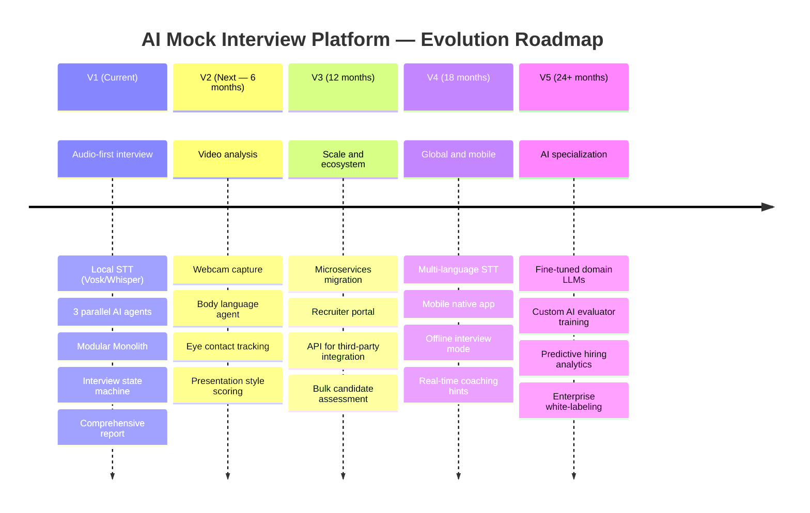
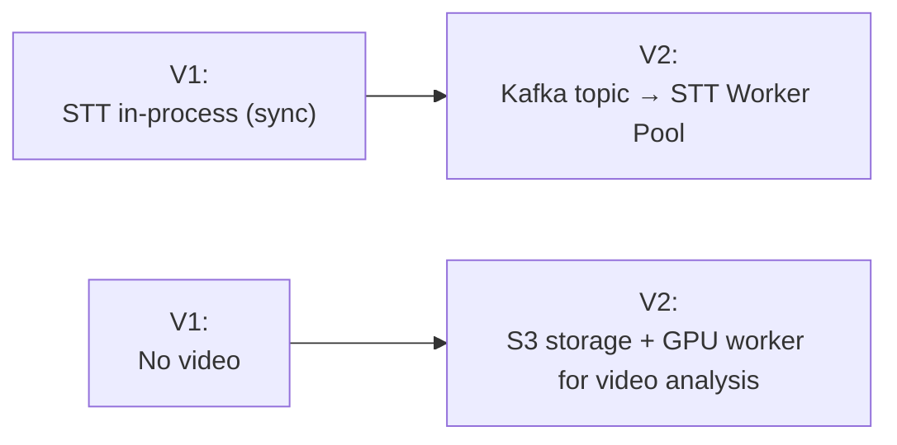
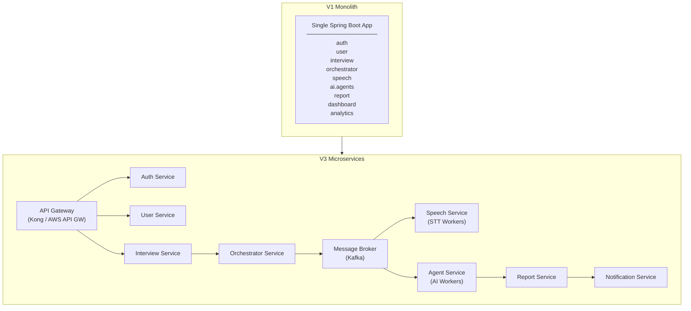
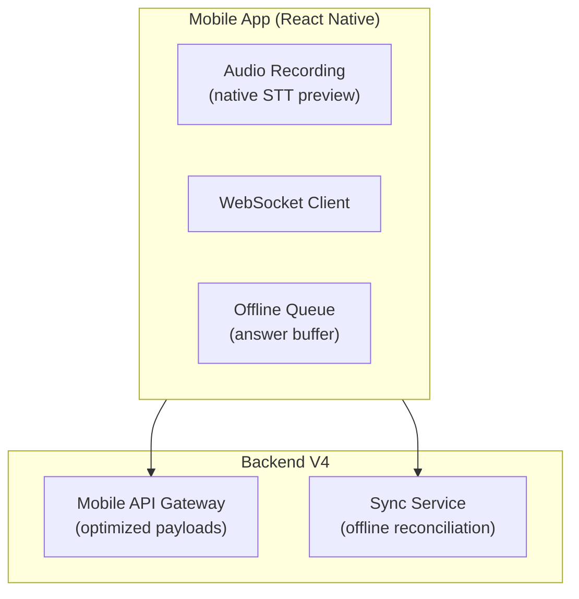
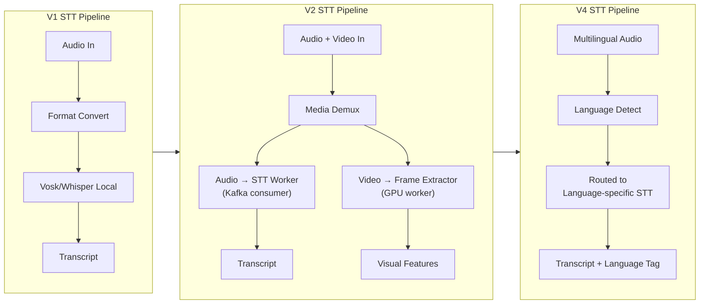

# 12 — Future Roadmap

> **Current Version:** V1 (Audio First — Modular Monolith)
> **Document Status:** Living Document — Updated with each version planning cycle
> **Technology Stack:** Frozen for V1 — See [17 — Technology Decisions](./17-technology-decisions.md)

---

## 1. Purpose

This document captures the strategic evolution of the AI Mock Interview Platform. It outlines planned versions, feature additions, architectural transitions, and the principles that guide prioritization decisions.

---

## 2. Roadmap Philosophy

> **Principle:** Build the simplest thing that delivers real value. Extend deliberately. Migrate architecture when scale demands it — not before.

Each version builds on the stable foundation of the previous one. The Modular Monolith architecture of V1 is specifically designed to make each of these upgrades a bounded, isolated change.

---

## 3. Version Roadmap Overview

---

## 4. V2 — Video Analysis & Enriched Evaluation

**Target:** 6 months post V1 launch

### 4.1 New Capabilities

| Feature | Description |
|---|---|
| **Webcam Recording** | Browser-native video capture via `getUserMedia` API |
| **Body Language Agent** | New AI agent analyzing posture, gestures, and facial expression |
| **Eye Contact Agent** | Tracks camera gaze percentage as a confidence proxy |
| **Presentation Style Score** | Combines audio fluency + visual delivery into a unified score |
| **Async Evaluation Option** | Video processing moved to async message queue (Kafka) |

### 4.2 Architecture Changes

| Component | Change |
|---|---|
| **Frontend** | Add video recording component alongside audio |
| **Speech Module** | Extended to handle combined AV streams |
| **AI Agent Layer** | Add `VideoAnalysisAgent`, `BodyLanguageAgent` |
| **Evaluation Aggregator** | New weights for video dimensions |
| **Storage** | Migrate audio/video to S3-compatible object storage |
| **Message Broker** | Introduce Kafka for async video processing queue |

### 4.3 Infrastructure Change

---

## 5. V3 — Microservices Migration & Recruiter Ecosystem

**Target:** 12 months post V1 launch

### 5.1 New Capabilities

| Feature | Description |
|---|---|
| **Recruiter Portal** | Dedicated UI for recruiters to view, filter, and compare candidate reports |
| **Candidate Shortlisting** | Score-based filtering; interview-to-job-requirement matching |
| **Public API** | REST API for third-party ATS (Applicant Tracking System) integrations |
| **Bulk Assessment** | Schedule and run multiple candidate sessions; batch reports |
| **Multi-tenant Support** | Enterprise accounts with isolated candidate pools |

### 5.2 Microservices Extraction Plan

The Modular Monolith V1 is designed so that each module maps directly to a future microservice:

### 5.3 Migration Strategy (Strangler Fig Pattern)

1. Extract lowest-risk module first (e.g., `user` service)
2. Route its traffic via API Gateway while monolith still runs
3. Validate for 2 weeks
4. Extract next module
5. Repeat until monolith is fully decomposed
6. Decommission monolith

---

## 6. V4 — Global Reach & Mobile

**Target:** 18 months post V1 launch

| Feature | Description |
|---|---|
| **Multi-language STT** | Support for Hindi, Spanish, French, German, Mandarin |
| **Multilingual AI Agents** | LLM prompts translated; evaluation adapted for non-native English |
| **Mobile Native App** | React Native (iOS + Android) — full interview experience |
| **Offline Interview Mode** | Complete interview offline; sync results when reconnected |
| **Real-time Coaching** | Live hints during interview (e.g., "speak slower", "add more detail") |
| **Adaptive Question Bank** | Pre-curated question pool with difficulty metadata for faster generation |

### 6.1 Mobile Architecture

---

## 7. V5 — AI Specialization & Enterprise

**Target:** 24+ months post V1 launch

| Feature | Description |
|---|---|
| **Domain-specific Fine-tuned LLMs** | Models fine-tuned on software engineering interview data for deeper technical accuracy |
| **Custom Evaluator Training** | Enterprise clients upload their own historical interview data to train custom evaluation models |
| **Predictive Hiring Analytics** | Correlate interview scores with hire success rate to improve scoring weights |
| **Enterprise White-labeling** | Custom branding, SSO integration, private deployment options |
| **Structured Interviewer AI** | AI conducts spoken dialogue (TTS + STT loop) for a fully conversational experience |

---

## 8. Speech Processing Pipeline — Future Evolution

---

## 9. Report Generation — Future Evolution

| Version | Report Capability |
|---|---|
| V1 | Text narrative + score breakdown. PDF export. |
| V2 | Video clip highlights embedded in report. Heatmap of eye contact. |
| V3 | Comparative benchmarking vs. other candidates for same role. |
| V4 | Multi-language report output. Shareable link with expiry. |
| V5 | Predictive employability score. Trend analysis across multiple sessions. |

---

## 10. Technology Evolution Map

> **V1 stack is frozen.** Deferred items (Faster-Whisper model size, TTS provider, Prometheus/Grafana) are tracked in [17 — Technology Decisions](./17-technology-decisions.md).

| Component | V1 | V2 | V3 | V4 |
|---|---|---|---|---|
| Architecture | Modular Monolith | Modular Monolith + Workers | Microservices | Microservices + Mobile |
| Messaging | None (sync) | Kafka (async) | Kafka (full event-driven) | Kafka + MQTT (mobile) |
| Storage | Local FS | S3 | S3 multi-region | S3 + CDN |
| Database | PostgreSQL single | PostgreSQL + Read Replica | PostgreSQL distributed | Distributed + TimescaleDB |
| LLM | Gemini (abstracted via AIProvider) | + Vision models / OpenRouter | + Custom fine-tuned | Domain-specific models |
| STT | Faster-Whisper local (model size deferred) | Local + Cloud option | Distributed worker pool | Multi-language router |
| TTS | Browser Web Speech API (provider deferred) | Piper / Kokoro (local) | ElevenLabs / Azure TTS | Domain-adapted TTS |
| Deployment | Docker Compose | Kubernetes (small) | Kubernetes (full) | Kubernetes + Edge nodes |
| Auth | JWT (RS256) | JWT + MFA | JWT + SSO (SAML/OIDC) | Same + mobile biometrics |
| Monitoring | Spring Boot Actuator | Prometheus + Grafana | Grafana + Loki + Tempo | Full observability suite |

---

## 11. Guiding Principles for Future Decisions

1. **Privacy by design** — Audio and video data stays on-premises or in controlled cloud storage; never becomes training data without explicit consent.
2. **Provider agnosticism** — No hard dependency on any single LLM, STT, or cloud provider; abstractions maintained at every layer.
3. **Backward compatibility** — API versioning ensures existing integrations are never broken.
4. **Extract on demand** — Do not extract microservices until a module's throughput or team ownership genuinely justifies it.
5. **Score determinism** — All composite score computation remains in the backend evaluation aggregator, regardless of how many AI agents are added.
6. **Candidate transparency** — Candidates always understand how their scores are computed; no black-box verdicts.

---

## 12. Open Research Areas

| Area | Question |
|---|---|
| **LLM Hallucination in Technical Evaluation** | How do we detect when the Technical Agent confidently scores incorrect answers highly? |
| **Bias Audit** | Does the English Agent penalize non-native speakers unfairly? How to measure and correct? |
| **Optimal Difficulty Algorithm** | What is the best reinforcement signal for the Difficulty Manager? |
| **Interview Length vs. Accuracy** | At what question count does score reliability plateau? |
| **Multi-modal Fusion** | How to combine audio and video scores for a coherent composite? |
