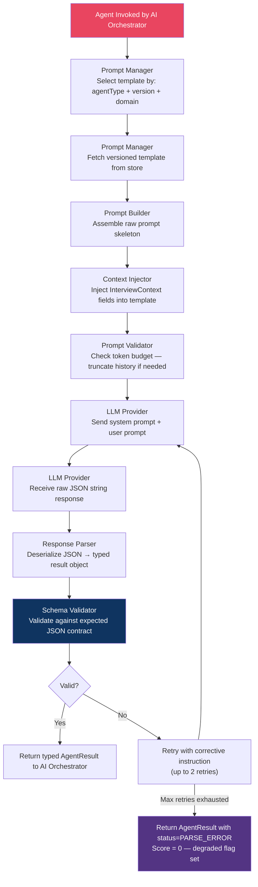
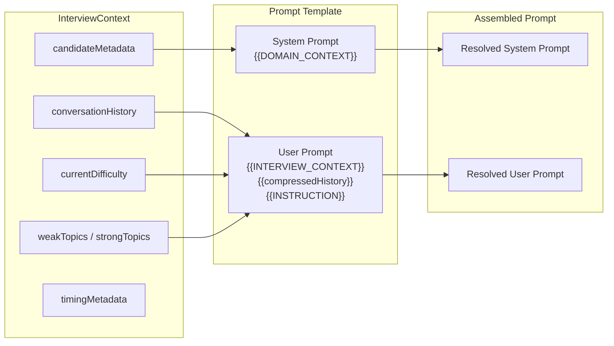
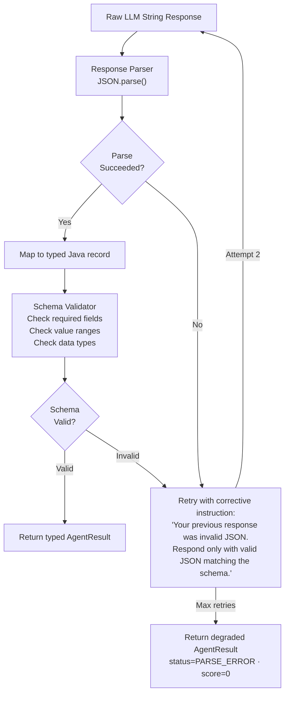
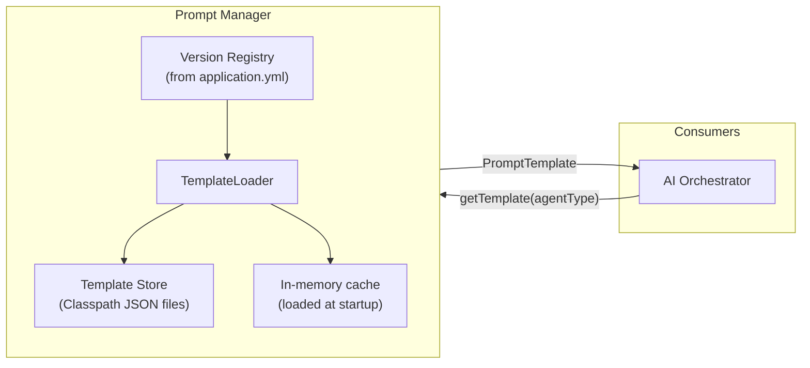

# 13 — Prompt Architecture

> **Version:** V1
> **Status:** Approved — New Document
> **Related:** [05-ai-agent-architecture.md](./05-ai-agent-architecture.md) · [14-ai-json-contracts.md](./14-ai-json-contracts.md)

---

## 1. Purpose

This document defines the prompt architecture for the AI layer — how prompts are constructed, versioned, injected with context, and validated. It is the authoritative reference for all prompt engineering decisions in the platform.

---

## 2. Prompt Lifecycle

Every LLM call in the system follows a strict, standardized lifecycle managed by the **AI Orchestration Layer**.



---

## 3. Prompt Versioning

Prompts are versioned artifacts — not hardcoded strings. This prevents prompt regressions and enables A/B testing.

### 3.1 Versioning Scheme

```
prompt-templates/
├── interview-agent/
│   ├── v1.0.0.json
│   └── v1.1.0.json     ← current
├── technical-agent/
│   ├── v1.0.0.json
│   └── v1.2.0.json     ← current
├── english-agent/
│   └── v1.0.0.json
├── behavioral-agent/
│   └── v1.0.0.json
└── report-compiler-agent/
    └── v1.0.0.json
```

Templates are stored as JSON files in the classpath and loaded at startup by the `PromptManager`. The active version for each agent is configured in `application.yml`:

```yaml
ai:
  prompt:
    versions:
      interview-agent: "1.1.0"
      technical-agent: "1.2.0"
      english-agent: "1.0.0"
      behavioral-agent: "1.0.0"
      report-compiler-agent: "1.0.0"
```

Changing a prompt version requires only a configuration update — no code change.

### 3.2 Template Structure

Each prompt template JSON contains:

```json
{
  "version": "1.1.0",
  "agentType": "INTERVIEW_AGENT",
  "systemPrompt": "You are an expert technical interviewer...\n{{DOMAIN_CONTEXT}}",
  "userPromptTemplate": "Interview context:\n{{INTERVIEW_CONTEXT}}\n\nInstruction:\n{{INSTRUCTION}}",
  "outputSchema": "interview_agent_output_v1",
  "maxContextTokens": 3000,
  "maxHistoryTurns": 6
}
```

Variables wrapped in `{{...}}` are replaced by the **Context Injector** at runtime.

---

## 4. Prompt Components

### 4.1 System Prompt

Defines the AI's role, persona, and behavioral constraints. Set once per agent type and does not change between turns.

**Structure:**
```
[ROLE DEFINITION]
You are an expert technical interviewer specializing in {{DOMAIN}}.

[BEHAVIORAL CONSTRAINTS]
- Always respond with valid JSON matching the output schema
- Never fabricate technical facts
- Maintain a professional, constructive tone

[OUTPUT CONTRACT]
You must respond ONLY with a JSON object matching this schema:
{{OUTPUT_SCHEMA_DESCRIPTION}}
```

### 4.2 User Prompt

Carries the per-call dynamic data — question, transcript, context. Built fresh for every LLM call.

**Structure:**
```
[INTERVIEW CONTEXT]
Domain: {{domain}}
Role Level: {{roleLevel}}
Current Difficulty: {{currentDifficulty}}
Question Number: {{questionNumber}} of {{totalQuestions}}
Topics Already Covered: {{coveredTopics}}
Weak Topics: {{weakTopics}}
Strong Topics: {{strongTopics}}

[CONVERSATION HISTORY — LAST {{N}} TURNS]
{{compressedHistory}}

[CURRENT QUESTION]
{{questionText}}

[CANDIDATE ANSWER]
{{transcript}}

[EXPECTED KEY POINTS]
{{expectedKeyPoints}}

[INSTRUCTION]
{{agentSpecificInstruction}}
```

### 4.3 Role Prompts

Each agent has a role-specific system prompt that sharply scopes what it is expected to do:

| Agent | Role Prompt Focus |
|---|---|
| Interview Agent | "You generate interview questions only. Do not evaluate." |
| Technical Agent | "You evaluate technical correctness only. Do not comment on language." |
| English Agent | "You evaluate communication quality only. Do not assess technical accuracy." |
| Behavioral Agent | "You evaluate soft skills only. Use the STAR framework where applicable." |
| Report Compiler | "You write a narrative report based on provided scores. You do not evaluate or score." |

---

## 5. Context Injection

The **Context Injector** populates the prompt template with data from the `InterviewContext` object.

### 5.1 Context Injection Diagram



### 5.2 History Compression Strategy

Full conversation history can exceed LLM context windows. The Context Injector applies a compression strategy:

| Strategy | When Applied |
|---|---|
| **Full history** | Turns ≤ `maxHistoryTurns` (default: 6) |
| **Tail truncation** | Keep last N turns when over budget |
| **Summarization (future)** | Replace older turns with a rolling summary for very long sessions |

Token budget is checked before sending. If the assembled prompt exceeds the model's context window, history is truncated from the oldest turn first.

---

## 6. Output Schema Enforcement

All agents are required to return **structured JSON only**. This is enforced at three levels:

| Level | Mechanism |
|---|---|
| **Prompt-level** | System prompt explicitly instructs JSON-only output |
| **API-level** | OpenAI JSON mode / Anthropic structured output enabled |
| **Validation-level** | Schema Validator verifies field presence, types, and value ranges |

### 6.1 Schema Validation Flow



---

## 7. Prompt Manager Architecture



The Prompt Manager loads all templates at application startup. Templates are immutable at runtime. Hot-reloading of templates is a V2 feature.

---

## 8. Per-Agent Prompt Summary

| Agent | System Focus | Context Injected | Output Schema Doc |
|---|---|---|---|
| Interview Agent | Expert interviewer; generate one question | Domain, difficulty, covered topics, history | See `14-ai-json-contracts.md` §1 |
| Technical Agent | Evaluate technical quality only | Question, transcript, expected key points | See `14-ai-json-contracts.md` §2 |
| English Agent | Evaluate communication quality only | Transcript only (no question needed) | See `14-ai-json-contracts.md` §3 |
| Behavioral Agent | Evaluate soft skills using STAR | Question, transcript | See `14-ai-json-contracts.md` §4 |
| Report Compiler Agent | Write narrative from scores; no evaluation | Final scores, metadata, per-turn summaries | See `14-ai-json-contracts.md` §5 |

---

## 9. Prompt Best Practices

| Practice | Implementation |
|---|---|
| **Single responsibility per prompt** | Each agent's system prompt is scoped to one evaluation dimension |
| **Explicit output contract in system prompt** | Schema is described inline in the system prompt, not just enforced externally |
| **No ambiguous instructions** | Prompts use imperative language — "Return a JSON object with..." not "You might return..." |
| **Fail-safe defaults** | If a field is uncertain, agents return a low-confidence score rather than fabricating data |
| **Prompt isolation** | English Agent does not receive technical question context — prevents cross-contamination |
| **Token budget awareness** | Context Injector always checks estimated token count before sending |
| **Version control** | All prompt changes tracked in Git with semantic versioning |
| **Regression testing** | New prompt versions validated against a golden test set before deployment |
