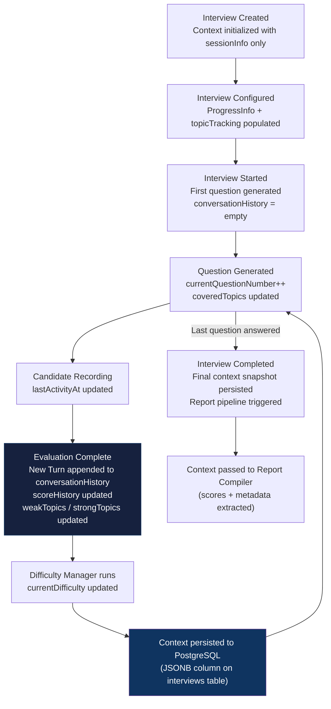

# 15 — Interview Context

> **Version:** V1
> **Status:** Approved — New Document
> **Related:** [07-interview-state-machine.md](./07-interview-state-machine.md) · [13-prompt-architecture.md](./13-prompt-architecture.md)

---

## 1. Purpose

This document defines the **Interview Context Engine** — the central stateful object that drives the adaptive behavior of the interview. It describes every field, how the context is created and updated, the memory strategy, and the difficulty progression model.

---

## 2. What Is the Interview Context?

The `InterviewContext` is the authoritative in-memory representation of a live interview session. It is:
- Owned and managed exclusively by the **Interview Orchestrator**
- Passed to the **Context Injector** before every agent call
- Persisted to PostgreSQL (as JSONB) after every update
- Reconstructed from the database on session resume

It is **not** a database entity exposed via an API. It is an internal value object used to drive intelligence.

---

## 3. InterviewContext Object

```json
{
  "$schema": "context/interview-context-v1",
  "description": "Full live interview session state",

  "sessionInfo": {
    "interviewId":       "uuid",
    "candidateId":       "uuid",
    "candidateName":     "string",
    "domain":            "Java Backend",
    "roleLevel":         "SENIOR",
    "templateId":        "uuid or null",
    "totalQuestions":    10,
    "durationMinutes":   45
  },

  "progressInfo": {
    "currentQuestionNumber": 3,
    "questionsRemaining":    7,
    "elapsedSeconds":        420,
    "currentDifficulty":     "HARD",
    "interviewState":        "WAITING_FOR_RESPONSE"
  },

  "topicTracking": {
    "coveredTopics":   ["garbage collection", "threading"],
    "weakTopics":      ["concurrency", "JVM internals"],
    "strongTopics":    ["OOP design patterns"],
    "targetTopics":    ["concurrency", "spring boot", "system design", "testing"]
  },

  "conversationHistory": [
    {
      "turnNumber":     1,
      "questionId":     "uuid",
      "questionText":   "Explain Java garbage collection...",
      "questionType":   "TECHNICAL",
      "difficultyLevel":"MEDIUM",
      "topicTag":       "garbage collection",
      "transcript":     "Java uses automatic memory management...",
      "compositeScore": 72,
      "technicalScore": 75,
      "englishScore":   80,
      "behavioralScore":62,
      "durationSeconds":45,
      "evaluatedAt":    "2026-07-01T18:05:00Z"
    }
  ],

  "scoringHistory": {
    "runningTechnicalScore":  72.5,
    "runningEnglishScore":    80.0,
    "runningBehavioralScore": 63.5,
    "runningCompositeScore":  72.1,
    "turnScores":             [72, 78, 65],
    "difficultyHistory":      ["MEDIUM", "HARD", "HARD"],
    "scoreTrend":             "IMPROVING"
  },

  "timingMetadata": {
    "sessionStartedAt":   "2026-07-01T18:00:00Z",
    "lastActivityAt":     "2026-07-01T18:07:00Z",
    "avgAnswerSeconds":   42,
    "longestAnswerSeconds":78,
    "shortestAnswerSeconds":18
  }
}
```

---

## 4. Field Descriptions

### 4.1 `sessionInfo`

| Field | Type | Description |
|---|---|---|
| `interviewId` | UUID | Unique session identifier — matches `interviews.id` in DB |
| `candidateId` | UUID | The authenticated user's ID |
| `candidateName` | String | Used in Report Compiler Agent prompts for personalization |
| `domain` | String | Interview domain (e.g., "Java Backend", "System Design") |
| `roleLevel` | Enum | JUNIOR / MID / SENIOR / LEAD / PRINCIPAL |
| `templateId` | UUID? | Interview template used, if any |
| `totalQuestions` | Integer | Configured interview length |
| `durationMinutes` | Integer | Session time limit |

### 4.2 `progressInfo`

| Field | Type | Description |
|---|---|---|
| `currentQuestionNumber` | Integer | Which question number is active (1-based) |
| `questionsRemaining` | Integer | `totalQuestions - currentQuestionNumber` |
| `elapsedSeconds` | Integer | Wall-clock seconds since `sessionStartedAt` |
| `currentDifficulty` | Enum | EASY / MEDIUM / HARD / EXPERT — set by Difficulty Manager |
| `interviewState` | Enum | Current state machine state (mirrors DB state) |

### 4.3 `topicTracking`

| Field | Type | Description |
|---|---|---|
| `coveredTopics` | String[] | Topics already asked — prevents repetition |
| `weakTopics` | String[] | Topics with average score below 60 — targeted for follow-up |
| `strongTopics` | String[] | Topics with average score above 80 — de-prioritized |
| `targetTopics` | String[] | Domain-appropriate topic pool for this interview |

The Interview Agent uses these to select the next question topic:
- **Prioritize** `weakTopics` when difficulty decreases
- **Avoid** `coveredTopics` unless follow-up is needed
- **Draw from** `targetTopics` for new questions

### 4.4 `conversationHistory`

Append-only array of all completed Q&A turns. Each entry is added after evaluation aggregation completes.

Only the **last N turns** (configured as `maxHistoryTurns`, default 6) are injected into prompts — older entries remain in the context object for analytics but are not passed to the LLM.

### 4.5 `scoringHistory`

| Field | Type | Description |
|---|---|---|
| `runningTechnicalScore` | Decimal | Rolling average of technical scores across all turns |
| `runningEnglishScore` | Decimal | Rolling average of English scores |
| `runningBehavioralScore` | Decimal | Rolling average of behavioral scores |
| `runningCompositeScore` | Decimal | Rolling composite average |
| `turnScores` | Integer[] | Composite score for each turn (used for trend analysis) |
| `difficultyHistory` | String[] | Difficulty level per turn (used by Difficulty Manager) |
| `scoreTrend` | Enum | IMPROVING / STABLE / DECLINING — computed after each turn |

### 4.6 `timingMetadata`

| Field | Type | Description |
|---|---|---|
| `sessionStartedAt` | DateTime | UTC timestamp when interview began |
| `lastActivityAt` | DateTime | Updated on every candidate interaction |
| `avgAnswerSeconds` | Integer | Rolling average of answer recording durations |
| `longestAnswerSeconds` | Integer | Longest single answer (may indicate verbose candidate) |
| `shortestAnswerSeconds` | Integer | Shortest single answer (may indicate disengagement) |

---

## 5. Context Lifecycle



---

## 6. Context Update Rules

| Event | Fields Updated |
|---|---|
| Interview starts | `progressInfo.currentQuestionNumber = 1`, `interviewState = STARTED` |
| Question generated | `coveredTopics` += new topic, `questionHistory` += new question |
| Answer recorded | `timingMetadata.lastActivityAt`, `avgAnswerSeconds` recalculated |
| Evaluation complete | `conversationHistory` += new turn, all `runningScore` fields recalculated |
| Difficulty adjusted | `progressInfo.currentDifficulty` = new level, `difficultyHistory` += level |
| Turn complete | `scoreTrend` recalculated from last 3 `turnScores` |
| Weak topic identified | `weakTopics` += topic if average < 60 AND topic not already present |
| Strong topic identified | `strongTopics` += topic if average > 80 AND topic not already present |

---

## 7. Memory Strategy

### 7.1 Hot Context (In-Memory)

The full `InterviewContext` object lives in the Java heap for the duration of an active session. It is updated in-place and serialized to PostgreSQL after each update.

### 7.2 Persistent Context (PostgreSQL)

Serialized as JSONB in `interviews.interview_context`. Updated after every state-changing event. On connection loss, the Orchestrator reloads from the database to resume.

### 7.3 Prompt Context (LLM-Injected Subset)

Only a subset of the context is injected into LLM prompts to manage token budgets:

| Injected | Not Injected |
|---|---|
| Last 6 turns of `conversationHistory` | Full history beyond 6 turns |
| `coveredTopics`, `weakTopics`, `strongTopics` | Raw timing metadata |
| `currentDifficulty`, `questionsRemaining` | Internal scoring history |
| `domain`, `roleLevel`, `candidateName` | `templateId`, `interviewId` |

Older history beyond `maxHistoryTurns` is retained in the context object for final analytics but never sent to the LLM.

---

## 8. Difficulty Progression Model

The **Difficulty Manager** reads the context's `scoringHistory` and applies the following algorithm after every evaluated turn:

```
scoreTrend = computeTrend(lastThreeTurnScores)

if scoreTrend == IMPROVING AND lastCompositeScore >= 75:
    recommend INCREASE difficulty (max: EXPERT)

else if scoreTrend == DECLINING AND lastCompositeScore < 50:
    recommend DECREASE difficulty (min: EASY)

else:
    recommend MAINTAIN current difficulty
```

### 8.1 Difficulty Transition Matrix

| Current \ Score Trend | IMPROVING (≥75) | STABLE | DECLINING (<50) |
|---|---|---|---|
| `EASY` | → `MEDIUM` | Stay `EASY` | Stay `EASY` |
| `MEDIUM` | → `HARD` | Stay `MEDIUM` | → `EASY` |
| `HARD` | → `EXPERT` | Stay `HARD` | → `MEDIUM` |
| `EXPERT` | Stay `EXPERT` | Stay `EXPERT` | → `HARD` |

### 8.2 Trend Computation

```
scoreTrend:
  last3 = last 3 turnScores
  avg_recent = mean(last3[1:])   — last 2 scores
  avg_older  = last3[0]          — oldest of the 3

  if avg_recent > avg_older + 5:  IMPROVING
  if avg_recent < avg_older - 5:  DECLINING
  else:                           STABLE
```

---

## 9. State Transition Alignment

The `interviewState` field in `progressInfo` mirrors the state machine defined in [07-interview-state-machine.md](./07-interview-state-machine.md). It is updated in the context whenever the Orchestrator transitions the interview state. This ensures the Context Engine and the state machine are always synchronized.
