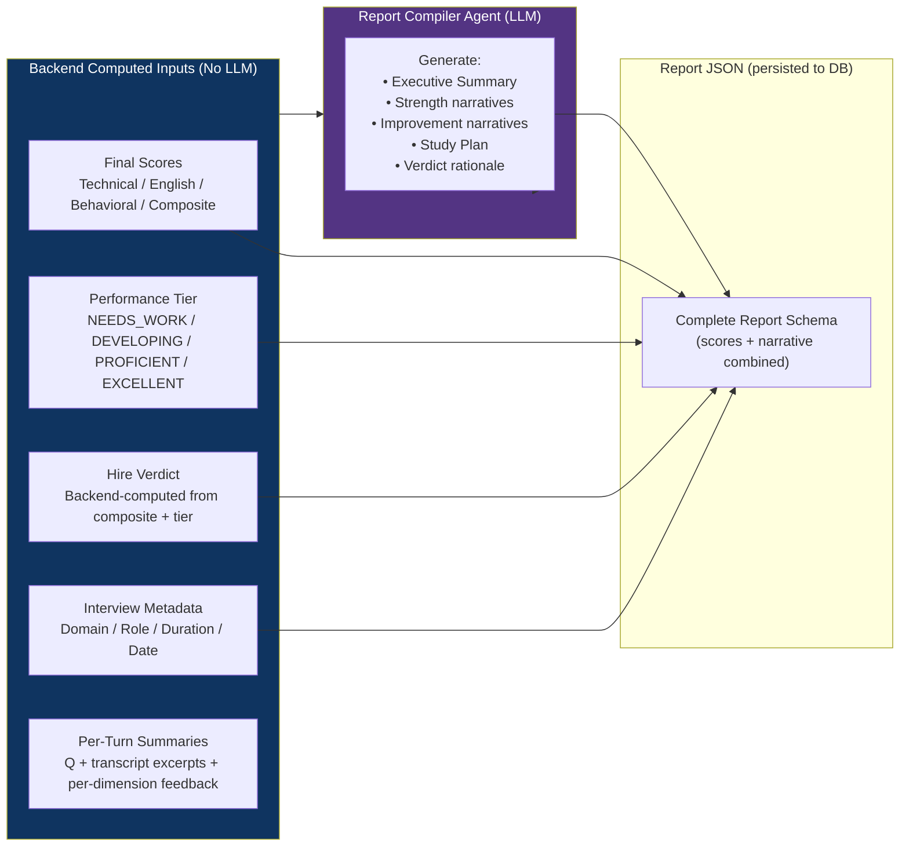

# 16 — Report Schema

> **Version:** V1
> **Status:** Approved — New Document
> **Related:** [14-ai-json-contracts.md](./14-ai-json-contracts.md) · [05-ai-agent-architecture.md](./05-ai-agent-architecture.md)

---

## 1. Purpose

This document defines the exact JSON structure returned by the **Report Compiler Agent** and persisted by the **Report Service**. This schema is the canonical contract for the final interview assessment report.

---

## 2. Design Rules

- The Report Compiler Agent returns **only structured JSON** — never Markdown, never prose outside JSON strings
- The Report Compiler Agent **never computes scores** — all numeric values are provided as input
- All scores in the report are computed by the **Evaluation Aggregator** (pure Java)
- The LLM's only contribution is: executive summary, strength narratives, improvement narratives, study plan, and verdict rationale

---

## 3. Report Generation Flow



---

## 4. Complete Report JSON Schema

```json
{
  "$schema": "report/interview-report-v1",
  "description": "Complete interview assessment report — persisted to reports table",
  "required": [
    "reportId", "interviewId", "metadata",
    "scores", "executiveSummary",
    "technicalAssessment", "communicationAssessment", "behavioralAssessment",
    "improvementRoadmap", "hiringRecommendation",
    "analytics", "generatedAt", "reportVersion"
  ],

  "properties": {

    "reportId": {
      "type": "string",
      "format": "uuid"
    },

    "interviewId": {
      "type": "string",
      "format": "uuid"
    },

    "reportVersion": {
      "type": "string",
      "description": "Schema version for forward-compatibility",
      "example": "1.0"
    },

    "generatedAt": {
      "type": "string",
      "format": "date-time"
    },

    "metadata": {
      "type": "object",
      "required": ["candidateName", "domain", "roleLevel", "totalQuestions", "durationMinutes", "completedAt"],
      "properties": {
        "candidateName":   { "type": "string" },
        "domain":          { "type": "string", "example": "Java Backend" },
        "roleLevel":       { "type": "string", "enum": ["JUNIOR","MID","SENIOR","LEAD","PRINCIPAL"] },
        "totalQuestions":  { "type": "integer" },
        "durationMinutes": { "type": "integer" },
        "completedAt":     { "type": "string", "format": "date-time" }
      }
    },

    "scores": {
      "type": "object",
      "description": "All scores are Backend-computed. LLM does not produce these.",
      "required": ["technical", "english", "behavioral", "composite", "tier"],
      "properties": {
        "technical": {
          "type": "number",
          "minimum": 0, "maximum": 100,
          "description": "Weighted average of per-turn technical scores"
        },
        "english": {
          "type": "number",
          "minimum": 0, "maximum": 100
        },
        "behavioral": {
          "type": "number",
          "minimum": 0, "maximum": 100
        },
        "composite": {
          "type": "number",
          "minimum": 0, "maximum": 100,
          "description": "Weighted composite: technical×0.5 + english×0.25 + behavioral×0.25"
        },
        "tier": {
          "type": "string",
          "enum": ["NEEDS_WORK", "DEVELOPING", "PROFICIENT", "EXCELLENT"],
          "description": "Backend-computed from composite score range"
        },
        "subscoreBreakdown": {
          "type": "object",
          "description": "Average of all per-turn subscores",
          "properties": {
            "technical": {
              "type": "object",
              "properties": {
                "correctness":    { "type": "number" },
                "depth":          { "type": "number" },
                "problemSolving": { "type": "number" },
                "completeness":   { "type": "number" }
              }
            },
            "english": {
              "type": "object",
              "properties": {
                "grammar":       { "type": "number" },
                "vocabulary":    { "type": "number" },
                "fluency":       { "type": "number" },
                "professional":  { "type": "number" },
                "fillerPenalty": { "type": "number" }
              }
            },
            "behavioral": {
              "type": "object",
              "properties": {
                "confidence":      { "type": "number" },
                "leadership":      { "type": "number" },
                "ownership":       { "type": "number" },
                "decisionMaking":  { "type": "number" },
                "professionalism": { "type": "number" }
              }
            }
          }
        }
      }
    },

    "executiveSummary": {
      "type": "string",
      "minLength": 50,
      "maxLength": 500,
      "description": "LLM-generated: 2-4 sentence overall narrative. Must reference domain, role level, and performance tier."
    },

    "technicalAssessment": {
      "type": "object",
      "required": ["summary", "strengths", "gaps"],
      "properties": {
        "summary": {
          "type": "string",
          "minLength": 30,
          "description": "LLM-generated: Overall technical performance narrative"
        },
        "strengths": {
          "type": "array",
          "minItems": 1,
          "maxItems": 5,
          "items": {
            "type": "object",
            "required": ["topic", "evidence"],
            "properties": {
              "topic":    { "type": "string" },
              "evidence": { "type": "string", "description": "Specific observation from the interview" }
            }
          }
        },
        "gaps": {
          "type": "array",
          "maxItems": 5,
          "items": {
            "type": "object",
            "required": ["topic", "observation"],
            "properties": {
              "topic":       { "type": "string" },
              "observation": { "type": "string" }
            }
          }
        }
      }
    },

    "communicationAssessment": {
      "type": "object",
      "required": ["summary", "strengths", "gaps", "fillerWordSummary"],
      "properties": {
        "summary": {
          "type": "string",
          "minLength": 30
        },
        "strengths": {
          "type": "array",
          "maxItems": 3,
          "items": {
            "type": "object",
            "required": ["dimension", "observation"],
            "properties": {
              "dimension":   { "type": "string" },
              "observation": { "type": "string" }
            }
          }
        },
        "gaps": {
          "type": "array",
          "maxItems": 3,
          "items": {
            "type": "object",
            "required": ["dimension", "observation"],
            "properties": {
              "dimension":   { "type": "string" },
              "observation": { "type": "string" }
            }
          }
        },
        "fillerWordSummary": {
          "type": "string",
          "description": "LLM-generated: Narrative about filler word usage based on aggregated filler data"
        }
      }
    },

    "behavioralAssessment": {
      "type": "object",
      "required": ["summary", "strengths", "gaps", "starMethodFeedback"],
      "properties": {
        "summary": {
          "type": "string",
          "minLength": 30
        },
        "strengths": {
          "type": "array",
          "maxItems": 3,
          "items": {
            "type": "object",
            "required": ["dimension", "observation"],
            "properties": {
              "dimension":   { "type": "string" },
              "observation": { "type": "string" }
            }
          }
        },
        "gaps": {
          "type": "array",
          "maxItems": 3,
          "items": {
            "type": "object",
            "required": ["dimension", "observation"],
            "properties": {
              "dimension":   { "type": "string" },
              "observation": { "type": "string" }
            }
          }
        },
        "starMethodFeedback": {
          "type": "string",
          "description": "LLM-generated: Assessment of STAR method usage across behavioral questions"
        }
      }
    },

    "improvementRoadmap": {
      "type": "object",
      "required": ["priorityAreas", "studyPlan"],
      "properties": {
        "priorityAreas": {
          "type": "array",
          "minItems": 1,
          "maxItems": 5,
          "items": {
            "type": "object",
            "required": ["rank", "area", "dimension", "observation", "recommendation"],
            "properties": {
              "rank":           { "type": "integer", "minimum": 1, "maximum": 5 },
              "area":           { "type": "string", "description": "Short label e.g. 'Java Concurrency'" },
              "dimension":      { "type": "string", "enum": ["TECHNICAL", "ENGLISH", "BEHAVIORAL"] },
              "observation":    { "type": "string", "minLength": 20 },
              "recommendation": { "type": "string", "minLength": 20 }
            }
          }
        },
        "studyPlan": {
          "type": "array",
          "minItems": 1,
          "maxItems": 10,
          "items": {
            "type": "object",
            "required": ["topic", "resource", "estimatedHours"],
            "properties": {
              "topic":          { "type": "string" },
              "resource":       { "type": "string", "description": "Book title, course name, or documentation link" },
              "estimatedHours": { "type": "integer", "minimum": 1 }
            }
          }
        }
      }
    },

    "hiringRecommendation": {
      "type": "object",
      "required": ["verdict", "verdictRationale", "confidence"],
      "properties": {
        "verdict": {
          "type": "string",
          "enum": ["STRONGLY_CONSIDER", "CONSIDER", "FURTHER_ROUNDS", "NOT_RECOMMENDED"],
          "description": "Backend-computed from composite score + tier mapping"
        },
        "verdictRationale": {
          "type": "string",
          "minLength": 30,
          "description": "LLM-generated: One paragraph explaining the verdict in human-readable terms"
        },
        "confidence": {
          "type": "string",
          "enum": ["HIGH", "MEDIUM", "LOW"],
          "description": "Backend-computed: HIGH when all agents succeeded; MEDIUM if one degraded; LOW if two+ degraded"
        },
        "degradedEvaluation": {
          "type": "boolean",
          "description": "true if any agent failed during evaluation — verdict reliability may be reduced"
        }
      }
    },

    "analytics": {
      "type": "object",
      "description": "Per-question breakdown for the report UI score timeline",
      "required": ["questionBreakdown", "difficultyProgression", "scoreTrend"],
      "properties": {
        "questionBreakdown": {
          "type": "array",
          "items": {
            "type": "object",
            "required": ["questionNumber", "topicTag", "difficultyLevel", "technicalScore", "englishScore", "behavioralScore", "compositeScore"],
            "properties": {
              "questionNumber":  { "type": "integer" },
              "topicTag":        { "type": "string" },
              "difficultyLevel": { "type": "string" },
              "technicalScore":  { "type": "integer" },
              "englishScore":    { "type": "integer" },
              "behavioralScore": { "type": "integer" },
              "compositeScore":  { "type": "integer" }
            }
          }
        },
        "difficultyProgression": {
          "type": "array",
          "items": { "type": "string" },
          "description": "Ordered difficulty level per question, e.g. ['MEDIUM', 'HARD', 'HARD', 'EXPERT']"
        },
        "scoreTrend": {
          "type": "string",
          "enum": ["IMPROVING", "STABLE", "DECLINING"],
          "description": "Backend-computed from last 3 turn scores"
        }
      }
    }
  }
}
```

---

## 5. Verdict Mapping (Backend Logic — No LLM)

The hiring verdict is computed deterministically by the backend before the Report Compiler Agent is invoked:

| Composite Score | Tier | Verdict |
|---|---|---|
| 80 – 100 | EXCELLENT | `STRONGLY_CONSIDER` |
| 65 – 79 | PROFICIENT | `CONSIDER` |
| 50 – 64 | DEVELOPING | `FURTHER_ROUNDS` |
| 0 – 49 | NEEDS_WORK | `NOT_RECOMMENDED` |

Confidence is set independently:
- `HIGH` — all 3 evaluation agents succeeded
- `MEDIUM` — 1 agent degraded (timeout/error fallback applied)
- `LOW` — 2 or more agents degraded

---

## 6. Example Report (Abbreviated)

```json
{
  "reportId": "3fa85f64-5717-4562-b3fc-2c963f66afa6",
  "interviewId": "9f1b9e4e-3b3d-4f2a-9e2d-1234567890ab",
  "reportVersion": "1.0",
  "generatedAt": "2026-07-01T19:00:00Z",

  "metadata": {
    "candidateName": "Aditya Sharma",
    "domain": "Java Backend",
    "roleLevel": "SENIOR",
    "totalQuestions": 8,
    "durationMinutes": 32,
    "completedAt": "2026-07-01T18:58:00Z"
  },

  "scores": {
    "technical": 72.5,
    "english": 83.0,
    "behavioral": 67.0,
    "composite": 73.75,
    "tier": "PROFICIENT"
  },

  "executiveSummary": "Aditya demonstrated solid Java backend engineering knowledge at a Senior level, with particular strength in object-oriented design and REST API architecture. While technical fundamentals were well-grounded, concurrency and JVM tuning topics revealed gaps that would benefit from deeper study before a senior-level role.",

  "technicalAssessment": {
    "summary": "Strong OOP fundamentals and Spring Boot proficiency. Concurrency and GC tuning need improvement.",
    "strengths": [
      { "topic": "Spring Boot", "evidence": "Accurately described auto-configuration and bean lifecycle in Q2." }
    ],
    "gaps": [
      { "topic": "Java Concurrency", "observation": "CompletableFuture exception handling was not addressed in Q5." }
    ]
  },

  "improvementRoadmap": {
    "priorityAreas": [
      {
        "rank": 1,
        "area": "Java Concurrency",
        "dimension": "TECHNICAL",
        "observation": "Candidate did not cover thread safety or lock-free data structures.",
        "recommendation": "Study java.util.concurrent deeply and implement 2-3 producer-consumer problems."
      }
    ],
    "studyPlan": [
      { "topic": "Java Concurrency", "resource": "Java Concurrency in Practice — Brian Goetz", "estimatedHours": 20 }
    ]
  },

  "hiringRecommendation": {
    "verdict": "CONSIDER",
    "verdictRationale": "Aditya is a strong candidate with solid backend foundations. A technical round focused specifically on concurrency and system design would help confirm readiness for a senior role.",
    "confidence": "HIGH",
    "degradedEvaluation": false
  },

  "analytics": {
    "difficultyProgression": ["MEDIUM", "MEDIUM", "HARD", "HARD", "HARD", "EXPERT", "HARD", "EXPERT"],
    "scoreTrend": "IMPROVING"
  }
}
```

---

## 7. Report Storage

The complete report JSON is stored in two places:

| Location | Column | Purpose |
|---|---|---|
| `reports` table | Individual columns (scores, verdict, narrative fields) | Queryable fields for dashboard and analytics |
| `reports.raw_json` | JSONB | Full report snapshot for export and forward-compatibility |

PDF export serializes the structured JSON into a formatted PDF using a server-side template renderer.
